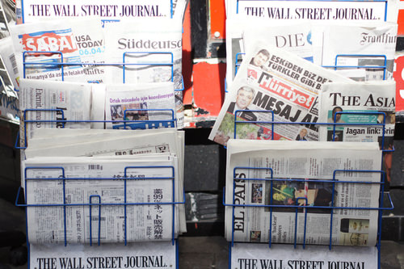

<!--
author:   Nina S. Scott - Phillips Academy Andover

email:    LiaScript@web.de

version:  0.0.1

language: en

narrator: US English Female

comment:  Journalism

logo:     ../cover.jpg

tags:      english, writing

-->

# Journalism 101

> This document was automatically translated to LiaScript from
>
> https://www.ck12.org/book/journalism-101/

## 1.0 The First Amendment

<article>

#### A CK-12 and Phillips Academy Publication 

 license. This license allows others to use, distribute, and create derivative works based on the content.")

---

> _[Burke](http://www.let.rug.nl/usa/biographies/edmund-burke/) said there were three estates in Parliament; but in the reporters' gallery yonder, there sat a Fourth Estate more important than them all._

[Thomas Carlyle](http://www.victorianweb.org/authors/carlyle/carlyle4.html)

Several years ago, on the first day of my journalism class at Phillips Academy, I asked my students to write down why they decided to take a course in writing and reporting the news. I told them to describe their philosophical ideals and their personal goals, and I told them to be honest. Perhaps their secret desire was to make or influence the news rather than merely to report it. Perhaps they were less concerned with journalism's contribution to democracy than with getting themselves a byline. I wanted them to tell me the truth, because journalism is about truth above all. "Abandon duplicity," I said, "and tell it to me straight."

"I had fifth period free," some wrote.

"I couldn't get into the class on Images of Women."

"My friend's roommate said it was a pretty good course."

Well, alrighty then. Fifth period free! I won't pretend their responses thrilled me—though that one kid clearly had a fine mind, the one whose friend's roommate took the course—but the truth is, the responses didn't surprise me either, because most of my students were born 15 minutes ago. To my students, events from the 20_th_ century feel historic, including the event of Watergate, if they've even heard of it, which most of them have not. Furthermore, they get their news from [Jon Stewart](http://www.thedailyshow.com/). I know you can do worse, but still, I should have known they weren't prepared to deliver confessions about their personal relationship to the concept of a free press. I should have remembered that most of them hadn't in their entire lives given a thought to the concept of a free press.

I had launched the course three years earlier for a few reasons. First, our school didn't offer a journalism course, and though you can't really learn how to be a journalist from taking a course, you can certainly get started that way. Secondly, such a course will teach you to think critically about the media, which is a skill all high school students should acquire lest they spend a lifetime being spun. Finally, writing news articles teaches you how to write, certainly as well as writing about Shakespeare can; it also teaches you how to think clearly, because you have to figure out what you are trying to say and then say it—accurately. So journalism, I thought, deserved a place in the Course of Study.

I narrowed the course down to print journalism and, specifically, to newspaper reporting and writing because I had been a print journalist; it's what I knew. Plus, I know that if you learn to write for a daily newspaper, you can take that skill to any sort of journalism—to TV or radio or magazines, and to digital journalism.

This FlexBook® textbook is designed to help students become capable print journalists in a hurry. It is also designed to help them think about the meaning of a free press and their responsibility as citizens to pay attention to the news. One shouldn't have to become a journalist to understand one's obligations as a citizen of a democracy, but the truth is, it was only after I became a newspaper reporter in Winston-Salem, North Carolina that I really understood how much it took for me to "get" a story, and how much it mattered that people should then read what I'd worked so hard to find out, _for them_. And, from there, it wasn't such a great leap for me to grasp that I wasn't just a reporter with a cool job finding out the news; I was also a citizen who, to be honest, hadn't always read the newspaper faithfully myself. I'd been a slug, really. I had taken my freedoms gladly—freedoms guaranteed by the very press I had mostly ignored—and now I understood that one of my _responsibilities_ as a citizen was to pay attention to the news. What a surprise for me! All these years later, this responsibility is a surprise to my students, too.

Finally, excellent journalism is different from lousy journalism, and this resource aims to inspire my students to become excellent at this work. And excellent journalism always begins with—and depends on—not only the talent but also the character of each individual journalist. In every chapter of this book, I return to that theme of my students' character.

#### Addendum

In the fall of 2012, I added a digital component to this book with the help of students in my journalism class at Phillips Academy. Connie Cheng '13 embedded web links throughout the text. Eric Ouyang '13 wrote a section introducing the digital world. Gabriele Fisher '13 authored the section on citizen journalism. Additional support and inspiration came from their classmates (all from the Class of 2013): Shireen Aziz, Ida Dhanuka, Leta Elias, Andrea Hewett, Sung Woo Hong, Jordan Johnson, Lauren Kim, Se Hwan Kim, Christian Langalis, Kayla Maloney, Will Rodriguez, and Gina Sawaya.

During the summer and fall of 2013, Connie Cheng also worked with me to edit and revise the book and create the CK-12 FlexBook® version.

The cover features a photograph by Kastan Day '16.

</article>

### 1.1 Why Study Journalism?

<article>

> _Life only demands from the strength you possess. Only one feat is possible—not to have run away._

[Dag Hammarskjöld](http://www.daghammarskjold.se/biography/)

So why _do_ you want to study journalism? Only kidding, I know why: you have fifth period free. No, actually, I'm not kidding—I want you to answer the question. Think about why you want to study journalism, and why you want to learn how to report and write for a newspaper. First, think about why good journalism matters in the world. It does, very much. I learned this when I was your age, when the Pentagon Papers, and then Watergate, were the breaking stories.

The [Pentagon Papers](http://www.archives.gov/research/pentagon-papers/), in case you don't know, was a top-secret study of the Vietnam War commissioned by the U.S. Secretary of Defense in 1967, while the war was still raging. The study described extensive illegal military maneuvers the American people knew nothing about, including American bombing of Laos and Cambodia, sovereign nations that were not even in the war.

In 1971, the study was leaked to _The New York Times_ by a man named [Daniel Ellsberg](http://www.ellsberg.net/bio), and then _The Times_'s editors had a crucial decision to make: Should they publish a top-secret classified document? If they did, the government might censor the paper on the grounds of national security and might prosecute Ellsberg for treason. Many lawyers argued the paper should not publish; the editors, however, and the paper's lawyers, believed the [First Amendment](http://en.wikipedia.org/wiki/First_Amendment_to_the_United_States_Constitution#Text) gave the newspaper the right to tell the American people what their government was doing. They also believed the study would not aid the enemy or jeopardize national security, and so they began publishing excerpts. The [government sued](http://www.digitalhistory.uh.edu/disp_textbook.cfm?smtID=3&psid=4093) to stop the publication, but the U.S. Supreme Court ruled the suit unconstitutional. Ellsberg turned himself in as the source of the leak and was charged with treason, but the charges were dismissed. Publication of the Pentagon Papers led to protests in the streets and, in time, changed the course of the war.

As for [Watergate](http://watergate.info/), this was the name of a secret illegal political operation run by President Richard Nixon and his staff. _The Washington Post_ uncovered it little by little in the course of a superb investigation undertaken by two very young, very dogged reporters who were supported by their editors and by _The Post_'s publisher, [Katharine Graham](http://en.wikipedia.org/wiki/Katharine_Graham), who did not back down when the Nixon administration threatened to cripple her paper financially. _The Post_'s [Watergate stories](http://www.washingtonpost.com/wp-srv/politics/special/watergate/coverage.html) led the Justice Department to indict and convict several of the president's advisors and led to President's Nixon's impeachment and resignation in 1974.

These two stories are iconic—they represent the pinnacle of a free press acting as the watchdog for its society—but every day, in stories published all around you, citizens are served and protected by this country's free press. Think, for example, about [CNN's coverage](http://www.youtube.com/watch?v=zd9380XRzRk) of Hurricane Katrina and what a difference it made that the press was on the scene when the catastrophe unfolded. Or go to the [website](http://www.nola.com/) of _The New Orleans Times-Picayune_ and read how the paper covered that storm's aftermath, literally for years. Or read today's _Washington Post_, _Wall Street Journal_, or _New York Times_, and consider what it means that the world KNOWS the stories they published.

Let's consider one story in particular, which was published in _The New York Times_ on October 29, 2006. Written by correspondent Sharon LaFraniere, the story, "[Africa's World of Forced Labor, in a 6-Year-Old's Eyes](http://www.nytimes.com/2006/10/29/world/africa/29ghana.html?pagewanted=all)," tells the tale of children in Ghana who work as slaves on fishing boats. They shiver through miserable hours of labor, flinch beneath beatings, and collapse at night onto dirt floors, where they sleep wearing the rags they work in. Some of these children are as young as six. Their parents leased them as indentured servants, and they are among 1.2 million children trafficked as slaves in Africa, Asia, and Latin America. You should read the story all the way through and then ask yourself these questions: Who cares that this information has been unearthed by a reporter and published? Who wishes the information had not been exposed? What difference does it make that the world has been told?

Then read a story on page A-3 of your favorite newspaper—or page 7 or 17, it doesn't matter—and select a story that is fairly short, that you can read in a couple of minutes. Now ask yourself the same questions: Who cares that this is in the paper? Why does it matter that readers are aware of it? You'll probably see that Ms. LaFraniere's story is a big story, a critical story, really, for the world to know, since it exposes a ghastly crime, and you're likely to see that your page A-3 story is a smaller story but still important, still a record of some true thing that has just happened in real time, something that deserves to be exposed to the light of day, to the gaze of the people.

I'm sure both the large and smaller stories gave you information you hadn't otherwise known, and I imagine Ms. LaFraniere's story also made you _feel_ something—for instance, that someone should really STOP THAT SLAVERY FOR CRYING OUT LOUD! And your passion would be priceless—your passion would justify every claim I could ever make about the role of journalism in society, its crucial importance to the world. Unfortunately, your passion about the children in Ghana doesn't automatically translate into action on anybody's part—even, at the moment, on yours, because you are a student after all, not a diplomat or a warrior—and those with responsibility for stopping the enslavement of children in Africa might have no response to Ms. LaFraniere's story.

This can be hideously depressing, but it illustrates an important point, which is that a journalist's power is limited to seeking out the truth and reporting it. After that, it's up to the readers—that is, it's up to the citizens—to respond. It is up to the citizens to change things if they have the power to do so, or to urge those in power to change things, or, if they live in democracies, to demand it. And we'll consider all of that in a moment.

For now, though, let's get back to Ms. LaFraniere. It seems possible that she risked her life to get that story, and, indeed, all over the world, journalists risk their lives for stories all the time. Here's a recent roundup, in a [press release](http://www.newssafety.org/news.php?news=20542&cat=press-room-news-release) from the International News Safety Institute (INSI):

**_Arab Spring fuels bleak winter for news media in 2012_**[\[1\]](#ftn1)

_8 Aug 2012_

_LONDON – At least 70 journalists and support staff were killed covering the news in the first half of this year in one of the bloodiest periods of recent times._

_Fifteen were confirmed dead in Syria alone between January and June, according to the biannual Killing The Messenger survey of news media casualties carried out for INSI by Cardiff School of Journalism._

_The next worst countries were Nigeria, where seven unidentified newspaper staff were killed by a bomb, Brazil, Somalia, Indonesia, where five journalists died in a plane crash, and Mexico._

_The toll compares with 124 for the whole of 2011 and 56 for the first seven months of last year. And 70 may be a conservative figure as INSI has recorded the deaths of an additional 30 news people where it was unclear whether the killings were related to their work._

_INSI invites anyone with more information on any of those unexplained deaths to make contact._

_"Journalists are more than ever in the cross-hairs of the enemies of freedom," said INSI Director Rodney Pinder._

_"Despite some encouraging international political moves to halt the murder, the gun and the bomb remain the favoured method of censorship in far too many countries._

_"Each and every killing chokes the free flow of information without which free societies cannot function."_

_The survey highlighted again that despite the Syrian conflagration the great majority of news media deaths around the world are in peacetime. Forty-three journalists died in countries officially at peace, victims mostly of vicious criminals, often abetted by corrupt security forces, politicians and business interests._

_Most of the dead were shot or bombed, but some suffered appalling ends - beaten, tortured, strangled, stabbed or decapitated._

_The third biggest cause of death was road accidents, every year a particularly wasteful loss._

_Scandalously, most of the killers of journalists continue to get away with it. In the first half of this year only one person was identified in connection with 47 targeted killings worldwide._

_The rate of impunity for murder of a journalists \[sic\] has remained constant at around 90 per cent globally for the past 10 years - undoubtedly fuelling more of the same._

_As a safety organisation, INSI records all deaths of journalists and other news workers in the course of their duties, whether deliberate or accidental._

After reading this press release, you are probably clutching your little face with an [Edvard Munch scream](http://www.moma.org/visit/calendar/exhibitions/1330), thinking, _No, no, no; this journalism class is too depressing. There's still time to switch courses. I'm out of here._

But the bottom line here is just the opposite of depressing. The bottom line here is not that humans steal children or run thieving corporations and corrupt governments or seize power with grotesque brutality and then behead the journalists who expose them. The bottom line here is that yes, humans do all these things, but journalists keep telling their stories.

And as long as journalists tell the stories, criminals—even criminal gangs and governments—cannot hide their crimes.

So now it must be dawning on you that to live in a country where the press is not censored or intimidated (or hunted down and shot through the head), and where, in fact, the people's freedom of speech is protected by the judicial branch of the government, is to enjoy a crucial liberty. So you can stand on the street corner holding a peace flag, and the police can't run you off—or you can write a story about the peace flags for a newspaper, and the police can't shut that paper down. And the newspaper can cover stories not only about peace flags, but also about slavery in Africa and corruption and lies in the White House.

This, of course, is why America's founding fathers wrote the first amendment to their constitution: "Congress shall make no law… abridging the freedom of speech, or of the press." The founders wanted their government not to repress its people but to govern with their consent, and a free press was their insurance policy.

Interestingly, in the 18_th_ century, such a free press was as radical an idea as the concept of democracy it was designed to protect. It had first been expounded by two London journalists, who wrote an [article in 1721](http://www.constitution.org/cl/cato_015.htm) under the pen name "Cato." At the time in Britain, it was a crime to criticize the royal government, and, the more true the criticism, the more severe the penalty for publishing it. In other words, you were guilty of libel if you wrote the truth. Cato argued that the exact opposite should be true—that you could not be guilty of libel if you wrote the truth, and this idea took root in the colonies among revolutionary journalists, including Benjamin Franklin, who published Cato's writings.[\[2\]](#ftn2)

The concept of a free press was born in America along with the country itself; though, just how free that press could truly be was not established right away. Indeed, the same men who wrote the First Amendment soon passed the [Sedition Act of 1798](http://www.constitution.org/rf/sedition_1798.htm). Designed to protect the infant nation under threat of war from France, the act prohibited publication of any "false, scandalous, or malicious writing" about the government, and under the act, two dozen men were arrested and their papers shut down. But when he became president, Thomas Jefferson declared the act unconstitutional, and it expired in 1801. In the two hundred years since then, the nation's courts have ruled again and again in favor of journalists' right to publish the truth, until gradually "the notion of a free press as a bulwark of liberty became embedded in American legal doctrine."[\[3\]](#ftn3)

"No other nation gives its journalists so much constitutional protection, and as a result, so much responsibility," write veteran journalists Leonard Downie and Robert Kaiser in their book, _[The News About the News](http://books.google.com/books?id=ySyfJQFajJkC&printsec=frontcover&dq=The+News+About+the+News&hl=en&sa=X&ei=4ze9UMbTBemy0QG5zIHQDA&ved=0CDgQ6AEwAA)._

We will spend plenty of time examining what it means to be a responsible journalist. In my opinion, that is the only type of journalist one can be. If a person isn't responsible at the work, she isn't really a journalist; she's just pretending to be a journalist while she wallows in the glory of her byline and believes, in her secret heart, that what's most important about her article is not the story at all, but the fact that SHE wrote it. And, the truth is, some journalists do work this way, but they are never the very best ones, as you will be, for they never really internalize what it means to defend the democracy with their personal resources, namely their energy and skill, their judgment, intellect, and courage.

For now, though, let's put all that away—we'll get back to it in later chapters. I want you to switch gears and stop thinking about your responsibilities as a future journalist. Instead—and this is the second thing I wanted you to consider—think about your responsibilities as a citizen.

If you are from a democratic country—America or otherwise—you have not only the right of free speech, but also the right to do something about the information you receive. So think about it. When a journalist's story is published, she rubs the back of her neck (she's been at that keyboard for weeks), sticks all her notes in a file drawer, crosses her fingers, and lets the chips fall where they may. She cares about her story—of course she cares about it deeply—but her job is over. Now it belongs to the people to do with it what they will. If they even read it.

And that is you—the people. If you take advantage of a democracy's gifts—your freedom to receive uncensored information, to begin with, and then, right up there on my personal all-time hit-list of privileges, your right to hold your government accountable with your voice and your vote—then I wonder if you feel you have any responsibilities in return? You are required to read the newspaper every day for this course, obviously, but forget about the course for the moment. Just as a citizen, do you have a responsibility to stay informed, to read the news that journalists have dug up on your behalf—even the boring news? Why or why not?

If you read the news, do you have any obligation to respond to it? And if so, what exactly would that obligation be? So naturally I believe you should make time in your day to read the stories that journalists have reported, verified, and written up on your behalf—make the time to think about these stories, to live up to your end of the democracy by holding your elected officials accountable with your vote (or at least to do that when you turn 18). Indeed, I believe these things should be habits, and you should feel just the tiniest bit superior to people who don't have these commitments—and you should never, ever date them! Not that it's my business...

But I'm sure you already know all this and are one step ahead of me, thinking, "Well, what if I _do_ read important stories and stay informed and go to the polls and vote, and then I _still_ don't really have an impact on things, like the child slavery in Africa."

And I say: Nevertheless, it is crucially important that you know the slavery exists. Knowledge is a light that shines into dark places. Your carrying the knowledge in your head (and heart) matters, even if, right now, you cannot know exactly what it means or what to do with it. And in situations closer to home—in the continuing saga in New Orleans (post-Hurricane Katrina), for example, or in whatever event was described on page A-3 of your favorite paper—your being informed is crucially important indeed. Your fellow citizens are reading the papers, too; together, you are the Fourth Estate, the people, the court of last resort, and a power that can change the world. But don't take my word for it. Think it through for yourself.

Finally, I encourage you to read [one more story](http://query.nytimes.com/gst/fullpage.html?res=9E0CE6DE133FF936A35751C0A9619C8B63) from _The New York Times._ It was written by Sharon LaFraniere and published on February 5, 2007, five months after the publication of the story, "Africa's World of Forced Labor, in a 6-Year-Old's Eyes." Here is an excerpt:

**_Building a Memorial to a Lost Son, One Child at a Time_**[\[4\]](#ftn4)

_By SHARON LaFRANIERE, of The New York Times_

_Published: February 5, 2007_

_Seven years ago, Pam Cope owned a hair salon in Neosho, a tiny southwest Missouri town, and her husband, Randy, had just been appointed vice president of a company that ran a string of newspapers there and in neighboring states._

_Their lives revolved around their son's baseball games, their daughter's dance lessons and trips to places like Walt Disney World._

_''My world was very small,'' Mrs. Cope said in a telephone interview in late January from Neosho, where she still lives. ''I was pretty shallow.''_

_Few would say that today._

_Early last month, Mrs. Cope returned from Ghana, where she had financed the rescue of seven children who were working as indentured servants on fishing boats for as little as $20 a year. The youngest of them, Mark Kwadwo, 6, had labored in dire conditions under a brutal fisherman who beat him when he did not get up at midnight to bail out canoes._

_Working with a small Ghanaian charity, Mrs. Cope paid $3,600 to free the children and found them a new home in an orphanage near Accra, the capital. After years of privation, the children were dumbstruck by the plentiful breakfast served at the orphanage, caregivers there said._

You should read the rest of the [article](http://query.nytimes.com/gst/fullpage.html?res=9E0CE6DE133FF936A35751C0A9619C8B63). It will give you hope. It will give you steam for the term to come.

### Exercises

1.  Take the front page (print copy) of a national newspaper. Pretend you are a dictator who controls the press. What stories from the front page would you censor and why? Cut them out. Discuss what the citizens are left with for their news, and what the citizens have lost.
2.  Select a story from your local newspaper (print or digital edition). Make a list of people who you think will—or should—care about this story, and explain why they should.
3.  In your own words, explain how a free press protects a society's other freedoms.

---

\[1. http://www.newssafety.org/news.php?news=20542&cat=press-room-news-release

\[2. Kovach, Bill and Tom Rosenstiel, _The Elements of Journalism_ (New York: Three Rivers Press, 2001), 22.

\[3. Kovach and Rosenstiel, _The Elements of Journalism_, 23.

\[4. http://query.nytimes.com/gst/fullpage.html?res=9E0CE6DE133FF936A35751C0A9619C8B63

</article>

### 1.2 Our Mission

<article>

> _There is something about him that suggests if Otis Chandler hadn't existed, Ernest Hemingway would have created him._

_[The Christian Science Monitor](http://www.csmonitor.com/1980/0207/020761.html)_

When I was first creating this course, I flew to California to meet one of the country's most famous newsmen, [Otis Chandler](http://en.wikipedia.org/wiki/Otis_Chandler), Phillips Academy Class of 1946. At Andover he had been a good guy and a great athlete, and after Andover he became a world-class shot-putter and surfer.

In 1960, he took over as publisher of his family's newspaper, _The Los Angeles Times_—which, at the time and for generations before, had been a notoriously awful newspaper, full of biased news and compromised stories, and no one in the publishing world expected much different from the young blonde hunk who took the paper's reins at age 33.

But he shocked the publishing world by transforming the rag into an outstanding newspaper. You can read about him in the book, _[Privileged Son: Otis Chandler and the Rise and Fall of the L.A. Times Dynasty](http://books.google.com/books/about/Privileged_Son.html?id=FCvoJFg5jjYC),_ or read [Hendrick Hertzberg's review](http://www.newyorker.com/archive/2001/04/23/010423crbo_books) of that book in _The New Yorker_.

, Otis Chandler's great-grandfather, served as the first official publisher of The Los Angeles Times from 1882-1917. After his death, his son-in-law Harry Chandler (left), Otis's grandfather, took over as the paper's publisher.")

I met Chandler in his private museum, a warehouse filled with glamorous vintage automobiles and dioramas featuring animals he had shot on his many adventures. He was tall and imposing even at age 74 and immensely charming. I told him about my plans for an Andover journalism course, and as I was talking, I was thinking about what was then the beginnings of a crisis in the American press, as the new model of digital journalism was just coming into being—and the old model of print and ink newspapers was just becoming vulnerable to the massive changes wrought by the Internet. Subscriptions fell, and advertising revenue fell in response. Media companies slashed their budgets by closing bureaus and laying off reporters and editors; even family-owned newspapers with a commitment to public service had to cut their budgets as they wrestled with how to shutter their expensive printing presses and deliver quality journalism in some profitable way on the web. Editors had to cover more territory and gather more information with fewer people; at a certain point, they had to turn their backs on stories they just didn't have the resources to pursue. Talk radio stations and 24-hour TV news shows meanwhile had to fill hours and hours of airtime with something inexpensive to produce; they padded their news with recycled sound bites, entertainment stories, trivia and gossip, and hours upon hours of commentary.

And yet more woes tumbled through my head: some journalists are lazy or dishonest or happy to pander to the people they cover, and nobody likes to read anymore, and everyone can't get enough of celebrities, and so on and so on—a real kaleidoscope of nightmarish thoughts. And next thing I knew, I was telling Otis Chandler that I wondered if I should even create a course in print journalism. Maybe the basic skills of reporting and writing for a newspaper were not skills that would benefit my students one single bit.

Believe me, I hadn't intended to get so confessional. It was all a little awkward, frankly, with the grizzlies and bighorns staring away as I blabbed at one of the most significant figures in American publishing history. Not to mention that I was breaking the first rule of interviewing. (First Rule of Interviewing: The person you interview should be talking, and you should be shutting up and taking notes.) But when I started my confession, he encouraged me to talk. And the more I talked, the more still he sat and listened. Then he said, "No, you're doing the right thing."

Otis Chandler died in 2006 before he could keep his promise to visit our class. But he gave me advice, and I'm keeping that. He said the crisis in American journalism is real: media companies want profits, news budgets are shrinking, advertisers are moving to the Internet, people like to watch TV. Still, he said, newspapers are important—the most important journalism of all. When people want a comprehensive understanding of something in their world, they turn to the papers. They also enjoy reading strong writing about all sorts of interesting and meaningful things.

Chandler was talking about hard copy newspapers, but his words back then applied to online versions of newspapers, too—a story is a story (is a story), no matter how it's delivered. He said I should teach my students to become the reporters the country's best news organizations want to hire. Teach them to report and write, he said, and if they end up making journalism a career, they should also become expert in one other subject—science, medicine, religion, technology—because these subjects will make news in the future and will need intelligent coverage from journalists with real expertise. What the press needs now, more than ever, he said, are smart and ethical young journalists coming up through the ranks. You teach them, he said. The country needs them.

In the years since then—nearly a decade now—the digital media revolution has swept away traditional journalism and all the old business models that went with it. We are in a radically new media world, a world still wildly in flux. Yet what Otis Chandler said to me remains utterly true. In fact, more than ever, the press today needs smart and ethical young journalists who can gather information from quality sources and evaluate the material—raw data, opinion, citizen journalism, propaganda, spin—that bombards us constantly from the web. The press needs these journalists, and the country needs them, too.

### The Requirements for Success

In a week or so, you'll start reporting for this class. You'll write articles and, if they're any good, offer them to your school newspaper. So in a week or so, you won't only be a student learning about journalism—you'll be a journalist, practicing the craft. You won't have any credentials, but interestingly, you don't need any. In this country, you need a license to practice dentistry, or drive a car, or run a beauty salon, but you don't need one to be a newspaper reporter and inflict your version of events on your community.

I always found this fascinating, given how much more damage you can do with a newspaper than with a manicure. So even though a real license for this work does not exist, I am inventing one, which you will need in order to succeed in this line of work (and in this class). To earn the license, you must:

#### 1. Know _The Post_'s Principles

_The Washington Post_ is one of the finest newspapers in the nation and the world. For a very long time, it was owned by the Meyer family who, along with the Sulzberger family of _The New York Times_, embodied the highest ideals of American journalism. Most importantly(!), it's where [Gary Lee](http://en.wikipedia.org/wiki/Gary_Lee_%28journalist%29), Phillips Academy Class of '74, worked.

Gary Lee is handsome and beautifully well spoken with a soft voice that compels a listener—and you should see how he dresses. If you plan to go toe-to-toe with the Soviets during the collapse of communism, you had better be wearing some excellent shoes, which I am sure Lee was when he did. At _The Post_, he has been a political reporter, a foreign correspondent, and a bureau chief, and now he is one of their star travel writers.

When a few students and I visited him in Washington several years ago, he gave us a tour of _The Post'_s newsroom. Then he sat us down at a conference table. It was a long table. He slid us each a reporter's notebook. Have you ever held one of these? They are fabulous but they make you nuts. They're long and thin, with the twirly wire on top, so you can write all the way down the little pages without banging your pinkie into a wire. They were designed not for this convenience but because they were slim enough to fit in a man's back pocket, or inside his sport coat. And even now, when women are also journalists (with big purses), everyone uses the slim, old reporter's notebooks with the wire on top, because they're so cool and easy to write on.

Because of their design, however, you can fill a page with notes and then flip it over the wire to start on a fresh page—BUT you can also swivel the notebook instead. And then, if you aren't careful, you'll soon be flipping your pages essentially backward.

And, even if you are careful, you can nonetheless lose control of your notebook because your source is talking quickly—he's the fire chief, he's trying to stop a conflagration—and in between barking orders to the firemen, he's telling you that the combustible agents might indicate the possibility of arson, or something like that. And you're racing after him and his words, trying to get them down, writing frantically, messily, flipping your notebook this way and that. The scene is chaos. There's fire over there, water spray here, flashing lights everywhere, and fire hoses underfoot (they are enormous, these hoses, as wide as sewer pipes, and made of a rough canvas that will break your ankle). You are stumbling about, scrambling after the chief. But stumble ahead you do, and again the chief says something like "mumble, mumble combustible," before he says, "Look, lady, get back behind the yellow tape!" The next fireman you grab tells you yeah, they're pretty sure it's arson but you can print _only_ whatever the chief said. Okay, no problem, you've got the chief's quotes in your notebook. You journey back to your desk in the newsroom, but as you're trying to translate your notes into a story, you find that everything is a blur, literally! The quotes that overrun one page might continue here, or maybe here—it's not that easy to tell, any of it might be logical—and what about _these_ words, the ones you wrote squished and sideways in the margin? Is that still the fire chief talking? Or the bystander? Not that any of this has happened to me...

But back to the conference table at _The Washington Post_. Gary Lee handed us each a reporter's notebook. Then he put both hands on the table and leaned forward, as if he were about to push himself up. But actually he was just looking at us, pretty closely. Maybe trying to determine if we had what it took for this line of work. Then he told us that we were learning a noble profession—that a good newspaper is vital to society. He said that the ideal paper contains two types of stories on its front page every day: the lede story, containing the day's most important news, which every citizen should read, and a "buzz story," containing the day's most interesting, exciting, fascinating, or amusing news, which every citizen would desire to read. To successfully find and report both those stories, he said, the journalists at _The Washington Post_ consciously commit, every single day, to the standards of the paper's founder, [Eugene Meyer](http://en.wikipedia.org/wiki/Eugene_Meyer).

Here are Mr. Meyer's principles. He delivered them in a speech on March 5, 1935. They are on a plaque in the newspaper's front lobby; the reporters and editors pass by them several times a day:

* The newspaper shall tell ALL the truth so far as it can learn it, concerning the important affairs of America and the world.
* As a disseminator of news, the paper shall observe the decencies that are obligatory upon a private gentleman.
* What it prints shall be fit reading for the young as well as the old.
* The newspaper's duty is to its readers and to the public at large, and not to the private interests of its owners.
* In the pursuit of truth, the newspaper shall be prepared to make sacrifices of its material fortunes, if such a course be necessary for the public good.
* The newspaper shall not be the ally of any special interest, but shall be fair and free and wholesome in its outlook on public affairs and public men.

Gary Lee and his colleagues at _The Post_ take these principles very seriously, and so should you—learn them by heart.

Don't get grumpy! You've memorized Shakespeare, you've memorized clumps of _The Canterbury Tales_ (in Middle English)—you can learn these principles. Plus, they are as graceful as any literature ("observe the decencies that are obligatory upon a private gentleman"), though if you aren't in the mood to memorize them, you may paraphrase them instead. But whatever you do, know them by heart; this will help you internalize them.

Among the students visiting _The Post_ with me was Clem Wood '04, who was at the time Editor in Chief of _The Phillipian_. After Andover, he studied classics at Harvard, so right away you can guess he is exceptionally bright. And he also has great courage. He stood up to people who tried to intimidate him—adults who wanted him to do things their way and students who wanted him to run articles he didn't think were clear enough or fair enough to run.

Once, a student came flying into _The Phillipian_ newsroom and went berserk, screaming that his (poorly written) commentary article had better be published or this was bullsh--, it was censorship. And Clem stood in the middle of the room, perfectly impassive, never flinching (chairs were being scraped and shoved around), never losing eye contact with the student. Finally, Clem said, "I heard you, and I'm not going to run it." And that was that.

So Clem was brave as well as bright, but what made him such a good editor, I think, is that he understood how, elementally, all of journalism is an act of character, and every journalist works with some deliberate understanding of the power of the press and his or her relationship to it.

Clem knew—as Gary Lee's colleagues at _The Post_ know and as you know now, too—that every decision you make as a journalist is, in essence, an ethical decision, and you will make those decisions wisely if you have a code to guide you, one you understand and believe in. Clem made a conscious decision to be a thorough reporter and an aware and careful editor committed to _The Post_'s principles; you will have a code, too. It should be a deliberate code, something that actually guides you as you pursue and write your stories and edit them. Some may choose to be guided by a code of greed, or vanity, or, god forbid, the code of "let's use the power of the press to 'get' people I dislike." Of course, they will reveal that code in their work. (The code of "do the least possible," too—that's a really transparent one.) But I think you should adopt Eugene Meyer's code over the others. And that's why I want you to learn the principles.

#### 2. Commit to the Truth

The most important of Mr. Meyer's focused and elegant principles is the first one. His newspaper's mission is to "tell the truth to the extent that it can be ascertained," and that should be your mission too.

Newspapers are non-fiction documents. They are a public record of a society's experiences, and they become, over time, the narrative of a society's history. Readers of a newspaper trust that it publishes the truth; if what is printed is untrue, that trust has been betrayed. And then of course the power of the press is eroded, and the democracy suffers, for if readers don't believe what they read, they won't respond. They won't act, won't vote, won't call their congressmen and women to say something should be done about the slavery in Africa. They won't even believe the slavery exists.

So newspapers take great pains to get their stories right. But newspapers are not machines; they are created by humans doing their jobs, so of course there are mistakes and errors in papers all the time. The important point is: the mistakes can't be deliberate. They can't be lies, falsifications, distortions, or deceptions. And when the mistakes are discovered, they must be corrected immediately, to set the public record straight.

So if you want to write for a newspaper, you must be committed right from the start to seeking the truth to the extent that you can find it. And you can't go off pretending to seek the truth, while really you're out to gather a few facts and jot down a few notes and race to the keyboard to write something gorgeous that people will read and swoon over and then ask you out on dates. Because if that's your motivation, you'll probably overwrite in the first place. Far more importantly, you won't have really thought through your story or done the careful work of reporting it thoroughly, and you won't bring the truth home to your editor. You'll bring some approximation of the truth, and don't even get me started about what happens when you do that to an editor (or yes, you can get me started, but not until the "Editors" section of this book).

Now I will muddy the waters by saying that the whole notion of truth can be complicated, as anyone who's ever used the passive voice can attest. (Me: What happened to the lamp? My kids: We were playing soccer and the lamp got broken. Verdict: The kids told "the truth.") And newspaper editors know as well as 10-year-olds do how tricky the idea of truth can be. They know that which stories they cover versus those they ignore, and the sources contacted versus those not called, and the quotes included versus those left out, and the story's tone, and the story's place in the paper, on what page, with what headlines, in what type, with (or without) what photos all affect how well the story reveals the "truth." We'll look at all this in the next chapter. We'll discuss the concepts of "fairness" and "balance" too. Hey, we can get altogether existential if anyone's in the mood.

You might take a moment now to consider these things in some depth, by reading the following links. The first is a [September 2012 blog post](http://publiceditor.blogs.nytimes.com/2012/09/04/facts-truth-and-may-the-best-man-win/?_r=0) by Margaret Sullivan in her role as the public editor of _The New York Times_, in which she considers how newspapers should cover political campaigns when the parties and candidates themselves spin the truth. The second leads to special coverage of "[Truth in the Age of Social Media](http://www.nieman.harvard.edu/reports/issue/100072/Summer-2012.aspx)" by the Neiman Foundation for Journalism, in which you'll find links to half a dozen superb articles. Finally, step into the shoes of a foreign correspondent in Afghanistan and read this [article](http://www.thedailybeast.com/articles/2013/05/12/when-a-bomb-goes-off-in-afghanistan.html) to find out what happens when the press is gutted and there are too few journalists covering certain stories.

But if any of this makes you worry about your ability to be a responsible journalist, then for now just remember that if you are trying earnestly to seek the truth about a story, you will have a good chance of finding it.

In January of 1971, _The Washington Post_ received a letter to the editor from a reader who was distressed that the paper had described Helen Keller as "deaf and dumb." The editors were ashamed that the language had slipped through. I always ask my students why the editors felt this way, and my students wisely point out that Helen Keller was extremely intelligent, while the word "dumb" carries the opposite connotation. And yes, that is so. But here's the bigger problem: Helen Keller was deaf and blind.

The truth can be complicated but it's also very simple. If you get your facts right, half the battle's won.

I have a nifty story, told to me by Rabbi Neil Kominsky, that will help you remember this. It is the story of a motivational speaker at a CEO convention. The speaker took a big glass beaker and filled it with rocks and asked the audience, "Is this beaker full?"

One of the CEOs raised his hand. "Yes," he said, "the beaker is full."

The motivational speaker said, "Wait just a minute." He then poured gravel into the beaker.

"Is it full now?" he asked.

Getting the picture, the CEOs shook their heads. "No," they said.

Then he poured in some sand. "Is it full now?"

"No!" they shouted.

Finally, the motivational speaker poured water into the beaker. "_Now_ is it full?"

And the CEOs shouted, "Yes, it is!"

And the motivational speaker said, "Okay! And what's the lesson we learn from this?"

A CEO raised her hand and said, "The lesson is that when you think you've done enough, there's always more you can do or learn."

"No," said the motivational speaker. "The lesson? Put the big rocks in first."

When you report your stories, put the big rocks in first. Get the facts. No exceptions.

We began this section of the book talking about _The Washington Post_ and its list of principles, which have guided journalists at _The Post_ for nearly a century. So now you should know that in the summer of 2013, the Graham family [sold _The Post_ to Jeff Bezos](http://www.washingtonpost.com/national/washington-post-to-be-sold-to-jeff-bezos/2013/08/05/ca537c9e-fe0c-11e2-9711-3708310f6f4d_story.html), CEO and founder of Amazon.com. The sale crystallized, in one fell swoop, the revolution sweeping through the American press, as one of the country's iconic newspaper families sold their [storied](http://online.wsj.com/news/articles/SB10001424127887324653004578650560401076322) flagship paper—the paper from the nation's capital, the paper that broke Watergate—to a dot-com billionaire.

The sale was a shock, no doubt. But most [reactions](http://www.washingtonpost.com/opinions/david-ignatius-post-sale-was-grahams-gift-to-journalism/2013/08/07/5442c212-feed-11e2-9a3e-916de805f65d_story.html) were, surprisingly, positive.

Experts in finance believe Bezos has a long-term plan for making the paper profitable.

And journalists believe that Bezos will cling tight to those principles that you so wisely memorized.

#### 3. Dread Mistakes

Your stories will have a big impact on people's lives. This is true of even small or ordinary stories, simply because they're read by so many people. I fully understood this only after I'd turned in my first article for the _Winston-Salem Journal_ in August of 1980. I woke at 3 a.m., panicking. The paper was already on the delivery trucks; what if the story was wrong?

I'd been sent out to cover a drug bust, and not knowing what else to do, I had rung the doorbell of the guy who'd been arrested. Evidently out of jail on bail, he answered the door and then answered my questions. What dumb luck. I came back with a scoop. It was so great.

Then the city editor grilled me on my facts, and the terrifying managing editor (whose glass office we called the Rage Cage) grilled me on my facts, and I answered all of their questions. I was dismissed and congratulated. The story would run on page one.

But now at 3 a.m. I realized: What if the guy who answered the bell wasn't the drug guy after all? What if he was _pretending_ to be the drug guy, but really he was that guy's prankster brother? What if I'd been hoodwinked like crazy, and my editor, unable to imagine I could possibly be that stupid, hadn't caught my mistake?

In that case, I was about to WRONG some innocent man. And, I knew how it felt to be wronged, just as everyone who has a sibling knows the feeling that comes over you when your sister tells your mother that YOU hit her first, and your mother, incredibly, believes it.

And I knew that if I ever opened a newspaper and read something about myself that was unfair or untrue, I would feel that same shock and fury, that same existential horror that a lie about me was being taken for truth. I didn't want to make anyone else feel that way, ever. I especially didn't want to make someone feel that way 75,000 times, which is how many issues of the _Winston-Salem Journal_ were just then making their way onto the city's lawns.

The next morning, the drug story turned out to be fine. I should have known it would be; I should have trusted the editors. My panic was just the smallest bit irrational. A lunatic brother, ha! Still, that long, grim sleepless night stayed with me, and I took meticulous care never to make mistakes about people in print.

And you must be careful, too. First because you never want to inflict the sort of pain that comes with an unfair characterization in the press. If you've never had it happen to you, you can't really understand how dreadful it is. But try to imagine. Of course you would never, ever deliberately mischaracterize someone in print (that would be cowardly, after all—better to have the guts to hit that person over the head with a rock), but you must take care that you don't do it accidentally, either.

Secondly, you must dread mistakes because they might make you timid. There's a saying: "A scalded cat fears even cold water." When you make mistakes, you get scalded. You feel bad, of course; plus you may get screamed at by an editor, or sued. You will wish your story could be unpublished, your words unread. But they can't be, and all the corrections in the world can't unmuddy the waters that you've muddied. So after you make a mistake in print, you will feel timid for a while, worrying that you might screw up again.

You can't be timid. You must be courageous. As a journalist, you act on behalf of the people in your community. You're not you; you're "the people"—just the one of them who happens to have the little notebook. You are a watchdog against abuses of power, and you are the chronicler of your community's truth. You cannot be afraid to dig around and bring the truth to light, even when it's unpleasant. So don't get scalded by making mistakes, because then you might lose your courage on stories you've got right.

If you take Otis Chandler's advice and become a skilled reporter with special knowledge in one focused area, and if you know _The Post_'s principles, commit to the truth, and dread mistakes, you will have the skills and motivation to produce splendid work. Of course no one is perfect—you'll screw up. But your editors will have your back.

### Exercises

1.  Translate each of Mr. Meyer's principles into a tweet. Use your own words and remember to keep it under 140 characters!
2.  What is the difference between facts and truth? Remember something that happened recently among your friends. It doesn't have to be a hugely dramatic event—just something interesting that happened. Tell the story in such a way that you do _not_ reveal the truth, even though you present the facts.
3.  What is your motivation in becoming—even for a semester—a journalist? Write 250 words.
4.  Do you have the self-awareness to recognize bias in your reporting or writing? What would you watch out for? Write 250 words.

</article>

### 1.3 What's in the Paper?

<article>

> _It is the newspaper's duty to print the news and raise hell._

[Wilbur F. Storey](http://en.wikipedia.org/wiki/Wilbur_F._Storey)

A newspaper contains all sorts of things: headlines, photos, graphics, sports scores, weather forecasts, gossip columns, obituaries, TV schedules, police reports, birth announcements, bird sightings, sudokus, etc. etc.—plus, in the digital editions, there are also all sorts of videos, audios, commentaries from readers, web links, and a million other bits of information and communication. Each of these is of great interest to some readers. But the most important things in the newspaper are its news stories, its opinion pieces, and its advertisements. Please note that news stories, opinion pieces, and advertisements are three very different things.

### News

The definition of news is changing as newspapers respond to a changing world. Once, it was "news" that someone in Newport, Rhode Island held a dinner party, and then for decades no one remotely cared, so it was not news, and now it is news again (read the [Style section](http://www.nytimes.com/pages/style/index.html) of _The New York Times_!). But even though the definition of news is changing, there are some traditional criteria for what is important enough or interesting enough to be considered news. This is called the **news value**:

* **Timeliness** – A story that just happened is more important than a story from the past; remember, the word is NEWs.
* **Proximity** – A story happening nearby gains news value because it may impact readers.
* **Consequence** – A story that directly affects the readers gains news value.
* **Prominence** – Stories that involve important people are traditionally more important than stories involving the rest of us (though great reporters with beautiful writing skills produce riveting stories about the rest of us).
* **Human interest** – Stories increase in news value when they contains oddity, emotion, or conflict.
* **Exclusivity** – Scoops still count; breaking a story that no one else has still has great value.

Newspaper editors must decide every day which stories in their community to cover, which ones to ignore, and where and how to display each one on the printed or online page. They make these decisions based on several factors: news value, staffing, space, and time. Some days, the editors really wrestle with these decisions, but lots of days—in fact, I'd say most of the time—when they hear that something's happened in their town or the world, they know instantly whether it's newsworthy, and they leap immediately into a frenzy of bossing the reporters around. These editors possess the elusive quality called news judgment: they know when something is news and when it isn't, and, interestingly, they often can't explain how they know. More on this soon.

News stories are objective reports of the truth, so far as such a thing can be ascertained. They don't contain a reporter or editor's opinion. They are written by reporters on the newspaper's staff; or the newspaper buys them from wire services (such as [UPI](http://www.upi.com/), [AP](http://www.ap.org/), [Bloomberg](http://www.bloomberg.com/), or [Reuters](http://www.reuters.com/)) or collects (and verifies) them from sources on the web.

**News stories** can be broken into four broad categories:

A **hard news story** is a response to an event. These are stories on fires, crimes, speeches, votes in Congress, testimony in court, hurricanes, etc. These are stories that essentially tell the readers _what happened_. Reporters and correspondents assigned to various beats are responsible for keeping track of what's going on in their beats, so they know when something "happens"—and of course editors also know what happens by reading other newspapers and the web and wire services and listening to TV and the radio. These are also called spot or breaking news stories.

A **feature story** is a response to an idea; feature stories may be human-interest stories, profiles of individuals, or stories on trends or innovations. These are stories that essentially describe for readers _what something is like_. Editors and reporters come up with these story ideas, and there is no magic formula for how to think them up. My rule of thumb is: If you are alive and aware and paying attention to your world, you will find stories everywhere. If something interests you, if it matters to you, if you want to tell your friends about something and you know they wouldn't be bored, it's a story.

An **investigative story** often springs from news events; they are in-depth stories reported over a long period of time and are usually designed to expose corruption or misdeeds.

**News analysis** is explanatory journalism, written by a reporter with expertise in a complicated subject who breaks it down to make it understandable to the reader and interviews experts for their opinions. It is not an opinion piece.

Some other news terms:

* **Folo story** – A story that follows up on a news story about breaking events ("folo" is short for "follow-up"). The breaking story will contain much information but will not be complete; elements of the story will come to light in the days to come. A folo story can be either hard news or a feature and would appear in the paper the next day. (For example, if the breaking story is about a tsunami, folo news stories would include more information about what happened when, what caused it, the number of victims, the status of survivors and aid efforts, and the status of investigations; folo feature stories might include a profile of the place, a detailed first-person account, or background information on weather science, economics, politics, history, technology, etc.)
* **Sidebar** – A shorter side story accompanying a main news story that covers a related angle or provides additional information. It's called a sidebar because in a print newspaper, it was placed alongside the main story, or beneath it. (For example, if the main story is about the tsunami, sidebars published concurrently might include a timeline of events, a compilation of immediate eyewitness reactions, or a summary of official government statements.)
* **Package** – Anchored by the main story, a package includes one or more sidebars with related information, photos, graphics (e.g. charts, diagrams, maps), a profile of a major stakeholder, or a news analysis piece. Online newspaper packages may include links and multimedia as well.
* **Dateline** – The location from which a story is filed.
* **Byline** – The name(s) of the reporter(s) who reported and wrote the story.

### Opinion

Opinion pieces, unlike news stories, contain the writer's opinion, and they appear in several places in the paper, which should be clearly marked. Opinions are what they sound like—the opinions of staff members or guest writers—but nonetheless, as with everything else in journalism, the opinions must be based on facts. This is often news (ha!) to novice journalists, who believe you can write pretty much anything you want in the paper as long as it's "only" your opinion or it's meant in jest, but this is not the case. (Lots more on all of this later, when you write your own opinion piece and when you study the laws of libel.) Opinions are identified by their placement on the paper's pages or labels on the website. If you ever read something and you aren't sure whether or not it's an opinion piece, the print or digital newspaper you're reading hasn't done its job. Opinion should always be clearly labeled.

#### Types of Opinion Pieces

The **editorial** is usually published in the paper's first section, on the last interior page, on the page's left side. On a paper's website, it's identified as "The Editorial." It offers the opinion of "the newspaper" itself on various topics of the day. Because the staff of a newspaper has access to information and a commitment to civic involvement, and because a newspaper is influential in its community, its "official" opinion is valuable to readers.

The editorial is written by an editorial page editor and his or her staff, who work in an office separate from the newsroom. This physical separation is important, as it underscores the philosophical separation between the editorial page staff—whose job it is to figure out and express the newspaper's opinion about the news—and the regular editors and writers at work in the newsroom, whose job it is to keep their opinions and indeed their feelings out of their articles. Consider how this works: If the editorial staff of a newspaper decides the paper is going to endorse Candidate A for governor, then it is clearly in everyone's best interest if these people think this decision through, discuss it, and write it up in a room far away from the newsroom where reporters and editors are racing around on deadline covering the things that happened that day on Candidate A's campaign trail, including the possibly ugly things, scandals, and missteps. The reporters can't be influenced by the editorial staff's preferences. The reporters must carry on "[without fear or favor](http://www.nytimes.com/1996/08/19/opinion/without-fear-or-favor.html "Without Fear or Favor")."

**Columns** are opinion pieces written in the first person by members of the newspaper staff or guest columnists. They're called columns because usually they're laid out in a column, and the columns appear throughout the paper. They are often pegged to this day's news.

**Op-ed pieces** are opinion pieces written by guest writers and experts. They're called op-eds because they appear opposite the editorial page.

**Letters to the editor**, and other user-generated comments submitted to digital newspapers, come from the readers. You should promise yourself that at least once in your life, you'll write a letter to the editor of your paper—not just a comment beneath a story online, but a letter.

### Advertisements

Ads are things that people pay to have printed in the paper. Advertisements should contain the truth, of course, but they don't have to run out and be all _explicit_ with the truth or anything, given that this is a capitalist land. So if you advertise that your popsicles have "the flavor of FRUIT FRESHNESS!" and lots of mommies believe that this means the popsicles contain fruit, while really it means the popsicles contain chemicals that give a fruit-like flavor—well, that's the mommies' concern, isn't it? And in capitalist America, yes it is. But a newspaper's advertisements should indeed tell the truth to the extent that advertising anywhere does so. (And just to reiterate: A newspaper's news and opinion stories should never be misleading or opaque, obtuse, duplicitous, or in any other way akin to advertisements. There should be no shenanigans. News and opinion pieces should be transparent and _explicit_.)

### Editors

Editors are not technically "in" the newspaper, although the top editors' names are printed on the paper's masthead. But editors are a crucial element in newspapers. And I use the term "element" deliberately, because they don't seem like normal humans, at least not to me.

My first editor was my journalism teacher at the University of North Carolina at Chapel Hill, the late Jim Shumaker. Every morning he walked into class and said, "Good morning boys and girls how in the hell are you?" He didn't pause between the sentences. He was a brilliant editor, and if you worked for him at the _Chapel Hill Weekly_, or if you got into his class, you never forgot the man. One of his students, an Andover graduate named [Jeff MacNelly](http://en.wikipedia.org/wiki/Jeff_MacNelly), himself a Pulitzer Prize-winning journalist, immortalized him in the comic strip _[Shoe](http://www.shoecomics.com/comics.php)_, about a grumpy bird editor who wears tennis shoes and smokes a cigar.

I took Mr. Shumaker's journalism course more than 30 years ago, and my memory isn't great, but I recall that he often wore a brown corduroy jacket—light brown really, sort of vomit-colored when you got right down to it—and his skin was wrecked the way smokers' skin is. But he was handsome; he had presence. He walked into class and said that funky greeting in a gravelly southern drawl, real slowly, as if it took an exhausting energy to greet us little weasels in our little student chairs, and we were all transfixed. He terrified us; we adored him; we wanted his attention. Everybody called him Shu.

It was as if we were in love! You know how that is, when you write something your crush is going to read, so you want it to be fabulous because your crush—that smart, witty, powerful and clever soul—understands the world in some mysterious, god-like way and will therefore appreciate how brilliant you are and how great your writing is. Naturally, this is nonsense; your crush is an idiot with the critical abilities of a lawn slug (which you will discover when you observe your crush flirting with someone who isn't you). But Mr. Shumaker was no idiot; he was the real thing. He was witty and clever, and he did understand in some mysterious, god-like way just exactly how the world worked.

Now, police officers understand how the world works, too, or understand a part of it, anyway—the part that involves crime and Dunkin' Donuts coffee and violent conflict. Similarly, politicians know their own world (coffee delivered by an aide, someone about your age). As do chefs (brew that coffee properly in a carafe!), and nurses (how we wish we had time for a cup of coffee), and mathematicians (the empty coffee pot's burning because we got distracted by an equation). Astronomers, bond traders, obstetricians, the social glitterati, competitive ice dancers—you name it—all these different people understand how their own particular world works, even though their worlds can be a real mystery to the rest of us. Students, too—you know how your school world works, including (or perhaps especially) those true things about your world that aren't well understood by, or are deliberately kept secret from, adults and other outsiders.

But what was so incredible about Shu is that he seemed to know how ALL these worlds worked. Of course, he couldn't have known EVERYTHING about EVERYTHING on the planet, but he knew how things tended to get done in most civic and social realms, and he had an unerring understanding of human nature, which of course is at the root of most news stories. So when one of our articles crossed his desk, he knew if the article accurately portrayed a world or if the article was somehow off. He knew if information was wrong or missing—even minute or esoteric information—and he also knew if we had "steered" the story somewhere it didn't belong, so that it wasn't necessarily inaccurate, but it hadn't entirely hit the truth.

Plus—and this was the part that really killed us—he also knew exactly why a story was off and whether it was our fault or not. It was as though, under his eyes, our bad sentences peeled themselves off the paper and pointed back at our solar plexuses, right into our souls. The convoluted sentences, the vague ones, the ones (so obviously!) missing a crucial fact, the ones subtly (ha!) promoting a point of view, the ones (ugh, it's embarrassing) showing off—every one of these sentences betrayed something about our characters. We'd become enamored of a source. We'd become afraid of one. We'd run out of gas. We'd been lazy, or smarty-pants pompous, or in love with our own writing. He knew it when we didn't even know it ourselves; he could read it in our sentences.

And Shu was not the only editor who could do this! So could Dick Oliver at the _New York Daily News_, who was my journalism teacher at Columbia. (He edited our stories with a red felt marker, so they came back looking like road kill.) So could Sylvia Lane and Joe Goodman, my editors at the _Winston-Salem Journal_: Sylvia edited—that is to say, psychoanalyzed her reporters—with grace and compassion, while Goodman did it a bit differently; his office is the one I described as "the Rage Cage," so enough said about that. Andrew Gully at the _Boston Herald_ did it while wearing a small diamond earring and swearing in a Boston accent.

The truth is, all great newspaper editors have this magical knowledge about how the world works, and also how their reporters work. They don't read like normal people—they read like witchdoctors. And if you are very lucky, you will work for one of these editors some day. They can see inside your soul; they will show you your character, your gifts, and your weaknesses. I call them editors from hell.

You will love and adore these people—yes, because they will show you your soul, but far more critically, because they will catch your errors and correct them. That is the truth. It is the editor's job to catch your mistakes before your stories get into print, and they will do it. Their Martian antennae (or whatever it is) will vibrate when they read in your seventh paragraph that the zoning board approved 1.4 acres for the parking lot—they will somehow _know_ that it must be more than that, or less—and they will protect you from your mistakes. So they are editors from heaven, too!

### The Newsroom

A newsroom looks just as you imagine it does—a space with the reporters' desks laid out to the horizon. The managing editor has an office with glass walls; at my paper, as you know, we called this the Rage Cage. Everyone in the entire room is always aware of what's happening in the Rage Cage—and all around the room for that matter—even as everyone is also intensely focused on his or her own work. Therefore, of course, the rooms can be seething nests of gossip, which in some offices might be distracting but in my old newsroom just added to the sparkling atmosphere.

Here are the jobs in a typical newsroom, with most newspaper staffs now adding online tasks to the job descriptions below:

**Publisher** – The paper's owner in some cases, but this is becoming increasingly rare in the era of corporate ownership.

**Editor-in-Chief** – The boss of everything in the newspaper except advertisements and the editorial.

**Editorial Page Editor** – The boss of the editorial and op-ed pages of the newspaper.

**Managing Editor** – Usually the hands-on manager of the newspaper.

**Section editors** – Editors in charge of each section, such as Metro, Features, Living/Arts, Business, Sports, Photography, Multimedia, Graphics, Library/Info Technology, and Production.

**Investigative reporters** – These are usually the most talented and experienced reporters, who work on special stories.

**Beat reporters** – These are usually experienced reporters who cover a specific area, such as politics, courts, the police, social services, business, the environment, etc. Beat reporters usually tell their editors each morning what story they'll be working on that day.

**General assignment reporters** – These reporters don't have a beat, so they are free to cover any story that comes up. Sometimes they tell the editors about stories they'd like to do; often, the editors assign stories to them. This is your spot or breaking news team.

**Cub reporters** – The newest members of the staff. They often start out by writing obituaries. This is not because obits are dull and gruesome chronicles of death. Actually, obituaries are about people's lives—they are feature stories about people who happen to be dead. And they teach young reporters crucial lessons about how to do things right in a newsroom.

**Deadlines** – Deadlines are not people, but they are entities in a newsroom nonetheless, and they affect everyone the way weather does in the summer, charging the atmospherics, shaping the plans. A news story is a living thing, and time is an element that defines its shape and depth.

In the old days, at the morning newspaper, deadlines were set late in the day, and the printing press rolled at night. Mornings in the newsroom felt calm. People would read the papers, drink their coffee, smoke their cigarettes, and hack and spit. (The old days were disgusting but fun.) Around 9 or 10 a.m., the editors gather in a conference room or in the managing editor's office for a **budget meeting**, in which they discussed which stories would be pursued that day. (Movies about newspapers always do a great job portraying budget meetings; I recommend [_All the President's Men_](http://www.imdb.com/title/tt0074119/) and _[The Paper](http://www.imdb.com/title/tt0110771/)_.)

As the morning rolled on, reporters made phone calls to sources or left the newsroom to interview people or track down documents. At 3 p.m. or so, the editors gathered for the afternoon meeting, in which they learned how the reporting was going and decided which stories would appear in tomorrow's paper and where they would be placed.

Then more cigarettes. The reporters smoked as they clacked away at the keyboard. When evening fell, the editors began roaming the newsroom, lurking over people's shoulders. They wanted the articles. They wanted them NOW. They had to read them, edit them, find and fix the mistakes in them. And the curtain of deadline had fallen.

These days, people don't smoke inside buildings, and a paper's news cycle isn't necessarily determined by the run of the printing press because stories are posted—and updated—on the paper's website constantly. Thus, the whole idea of deadlines is changing, and most papers are only beginning to sort out how their deadlines work.

For that matter, most newspapers now are trying to figure out how they should work in the new world of the web. What they do know, however, is that no matter how their news is delivered, they are in the business of digging it up and making sense of it for the people. So their reporters still wake up, drink coffee, read or listen to the news to learn what's happened in the world while they slept, and formulate their story ideas for the day. The editors still have budget meetings at 9 a.m. and again in mid-afternoon. And they and their reporters still race against an afternoon or evening deadline by which time the first version of their stories must be filed. So they gather—and put into perspective—the information they've found and verified up until their deadline, and they publish. Inevitably, the story, of course, will continue to unfold—time does not stop. But for today, their work is done.

### Exercises

1.  Deconstruct a section of a print newspaper. With a pen, identify whether each element on the page is a hard news story, a feature story, an investigative story, a news analysis piece, an opinion piece, or an advertisement.
2.  Find a news story presented as a package and make a list of its components.
3.  Read a breaking news story and come up with four ideas for folo stories. Brainstorm questions you still have about the breaking story, and outline both news and feature stories you think should appear in the paper tomorrow.

</article>

## 2.0 Reporting and Writing Skills

<article>

> _If your mother says she loves you, check it out._

Anonymous

That's a funny line up there about your mother; though, maybe if you think about it too much, it moves from funny to kind of desperately sad. But that's why it's such a perfect quotation for this chapter on reporting. Because when you report a story, what you are really doing is hunting to find the honest truth. Not the cliché truth, or the popular wisdom, or the thing that someone said was true, but the real truth—frank, weird, ugly.

And I shouldn't even say your job is to "find" the truth, because that implies the true story is out there somewhere, intact and gift-wrapped with a pretty, little ribbon, waiting for you to "find" it and bring it home to the newsroom. Yes, the truth is sometimes like that. But, most of the time, it isn't—it's a lot messier, and it's usually scattered around in bits and pieces. Furthermore, the truth changes over time, and it looks different from different angles.

So if you ever believed that fiction was the place for complex truths while journalism was the place for simpleminded chronicles of life's surface, think again. Truth can be stranger than fiction. Indeed, truth is often stranger than fiction _by far_. And it's not that easy to discover.

At the country's big newspapers, the most experienced and talented reporters are called "Investigative Reporters," and they tackle large and complex stories, often working in teams. But the title "Investigative Reporter" could rightly apply to _every_ reporter at the paper—even the baby cubbies, even the student reporters—because reporting is essentially investigating. When you report a story, you work just like a private eye.

First you gather information, which is called "doing legwork," and yes, you must use your legs to get out of the newsroom and dig around, see things for yourself, ask people questions, and track down documents. Of course it is possible to gather information on the Internet. But you can't report a story from your desk, on your butt. You must learn things firsthand. And when your legwork is done, you must double back and verify everything you thought you knew to begin with or learned along the way. If your mother said she loves you, now's the time you check it out.

And all the while that you are reporting, you must keep your mind supple enough to follow the story where it takes you—that is to say, your work is both physical (up you go, out the door) and intellectual. A story is a puzzle, and you are the investigator who must gather the pieces and fit them together, and you can't squish the pieces where they don't fit just because you want them to. That's another way of saying what you already learned in the introduction to this part of the book: you mustn't "steer" your story.

Instead, as you work, you might find your initial hunches were correct, but you might also find you were barking up the wrong tree entirely, and the story that is emerging is different than the one you thought you'd be writing. You must let that story emerge. Furthermore, you must be aware at all times of your own biases, and course-correct as you go, to keep the bias out of your way and out of your story.

Finally, you will be doing all this work against a deadline, and that pressure will help you concentrate, but it can also cause panic and mistakes. Thus, you must be constantly aware of the element of time, as you race against it to capture as much of the truth as you can find before you must stop reporting and start writing. The story may continue to unfold, but you can catch up with it the next day, in a follow-up story.

And how to do all this? To be perfectly honest, you will learn how to report a story only by going out and reporting one. For my first story at Columbia Journalism School, for example, I was sent to a polling place on Election Day. I was excited and eager and started interviewing voters. I walked right up to them in the polling place and asked whom they'd voted for and how they felt it was going out there, blah blah, and all at once a nice policeman came over to inform me that the press was not allowed within 100 feet of a polling place and I was most welcome to go to jail. I talked him out of that, but I was mortified and a little frightened. And you too will learn how to report a story only by bumbling your way through it a few times until you finally get the hang of the process. I'll describe that process in the next section, but you won't really register what it says; the information will lurk around blurrily in your mind's eye until you go out on your first story. Then it will come into focus.

Let's practice. Let's report an imaginary story. Let's look at the problem of teenage sexuality. Oh wait, there's already a bias in that idea: who says teenage sexuality is a "problem"? For that matter, what the heck is "teenage sexuality"? Okay forget that story, it's too fraught already. Let's tackle something important. Let's look at the parking situation at the hockey rink.

No, seriously, there is quite a bit of grumbling around town about how there aren't enough parking spaces in the lot beside the hockey complex on the south edge of Andover's campus. Maybe the problem is simply that there are two rinks there, which means lots and lots of skaters on the ice, most of whom aren't Phillips Academy students (who would walk to the rinks); they're young skaters, pee-wee hockey players (pee-wee skaters? Note to self: Find out what they are called) driven to the rink by parents who couldn't carpool even if they wanted to because the skaters might be wee, but their gear isn't, and you need pretty much an entire SUV to hold just one bagful of it, not to even mention the sticks.

So you must find out what's going on here—what is the problem? And maybe it's simply that the lot isn't big enough for all those kids and their gear. Now this would be a nice news story: whoever designed and built the complex screwed up in a big way. On the other hand, maybe there is plenty of parking, it's just that the primo spaces near the building are always filled, so the parents must lug those duffels a long way in the freezing cold. In which case, who could blame them for grumbling, but that's a different story. Literally.

So you wander out there to see for yourself how many rinks there are (two), and how many kids on the ice (plenty, but lots of them are figure skaters—with tiny white skates! and tiny leggings!), and how many SUVs are parked out back, and where exactly they're parked.

And you note that while all the spots are taken, no one has parked in the handicapped zone, no one has plowed onto the curb, no one's idling in the circle waiting for a space. So tonight, anyway, there appear to be enough spaces, just exactly enough—unless someone has dropped off his kid and driven home, and will drive back after practice, which is quite the polluting way to raise the future Michelle Kwan and extremely irksome to the ferrying parent who is hardly out of the bloody car before he has to get back into it—but that's another story, again. And indeed, maybe there's no news story here after all—there seems to be enough parking—but maybe there's a feature story here about the living hell of schlepping your kid endlessly to sports. So here's what you have learned from this tale, and what you will study in the upcoming part of the book:

**How to report a story:** You will learn lots of techniques for reporting, but the basic idea is simple: Go To The Hockey Rink. You report a story by going out there (wherever "there" is) to learn for yourself what is happening. Talk to people. Listen. As you report a story and learn more and more about the truth of things, the story will evolve, often becoming very different from what you thought it was when you started.

Anyone can park herself at a computer, Google something or someone, and write a "story" about it. That's not what journalists do, though; that is not reporting. Journalists unearth and gather information firsthand, make coherent sense of it, and verify it. That is what makes their work valuable.

**How to write a story:** When you write for a newspaper, your purpose is to tell your reader as much information as you can, quickly, clearly, and factually. Thus, you write news stories very differently from the way you write a novel or a short story. When you write fiction, YOU matter—you, the writer, the consciousness at work behind the words—and when people read your novel or short story, they commune with you, consciousness to consciousness, soul to soul. When you write for a newspaper, however, no one wants your consciousness or soul or anything else about you on the page. Particularly in a hard news story, you are simply the conduit for conveying information from the rink to the reader without interfering in any way; indeed, you want the reader to receive the information as if by an intravenous injection to the head. Thus, you write cleanly, concisely, but potently, selecting the right tone for the emotional register of each story. Writing a feature story about a mother balancing her checkbook behind the wheel of her Odyssey as she idles in front of the hockey rink, craving a cigarette her kids don't know she ever used to smoke, you might choose the tone of humor. Or (if you want to earn an A in the course) a tone of profound sympathy.

Before you go out on that first story, memorize these 3 rules. You must:

1. Identify yourself as a reporter before you start talking to anybody about any aspect of a story. It is crucial that people know what they're getting into when they talk to you or hand over documents—in person, or on the phone, or via email or fax. They need to understand that you are not interacting with them in the private realm, but that in fact you are going to share their words or information with other people—maybe thousands of other people. No one should interact with you in innocence of this, and if you allow people to think they're dealing with you privately, you are deceiving them. In this business, you must never deceive your sources, your readers, or (frankly) yourself.

2. Verify what people say to you and don't print a source's quote if it isn't true. I know this sounds obvious, but every year, one or two of my students include absurd quotes in their stories and then argue (_really argue_ with me) that the quote belongs in the story because the source "truly" said it! When this happens, I cover my face with my hands. I rub my eyes. I watch the psychedelic colors behind my lids and breathe deeply. Then I say, "Yes, it is indeed _true_ that someone gave you a quote, but it is not the journalist's job to report that someone spoke. It is your job to report _what_ they said. If what they said is true, print it. If not, don't." If you can't find out whether it's true or not, don't print it, because if it turns out to be false, you will have made a mistake. If what they said is false and damaging, you will be sued for libel. More on that later in the book.

3. Never steer your story. In other words, don't come to a conclusion about your story and then cherry pick facts to fit your conclusion. That's not journalism, that's propaganda, or spin. At Andover, the students are very fond of the staff workers in the dining hall. Many of the staff speak Spanish, and the students enjoy chatting with them in Spanish as the staff make their stir fry. There's something nourishing for both the staff and the students when they interact this way, something more than lunch that passes between them. It's friendship, or something like it; it's connection—a bridge between the world of working adults and the very lucky students they serve. Recently, the dining hall at Andover underwent a major renovation. Many of the staff who had previously been serving students in the stir fry line were now working backstage in the new dining hall's gleaming kitchens. The students missed the workers, and some students leaped to the conclusion that after the renovation, new fancy chefs were brought in—mostly white men the students hadn't ever seen before—while the Spanish speaking workers were relegated to lousy kitchen jobs. Editors at the school newspaper got wind of this and sent their reporters out to "get" the story that the new dining hall's policies included demotions based on the staff's ethnicity. Except the story wasn't there, because the Spanish speaking staff, like all the staff, both new and old, had been invited to choose the tasks they'd like to perform in the new dining hall and were trained in those tasks. Some of the staff who were once in the stir fry line didn't want to continue in stir fry—they preferred to work in catering, or in set up or clean up or food preparation. All the students had to do was _ask_ them where they worked now and why, and the staff would've told them. The newspaper's story focused primarily on the superficial count of Hispanic workers who were no longer out front serving students but were now invisible in the kitchen. The numbers were right, the facts were right, but the numbers carried implications of a policy, a vaguely racist policy, that didn't exist. The story had been gummed together with facts chosen to create the impression the editors wanted to convey—not the story that actually existed.

Remember that when you are a reporter, you gather bits and pieces of information from here and there, and you wave a wand until (presto!) it becomes a little white dove that flies away on its little wings. Except, actually, you don't wave a wand, and there is no presto! Instead, you piece together the story as well as you can, using _lots_ of information from _lots_ of sources combined with your judgment. And then you must ask yourself: Have you got it right? Did you make a dove? Or is it a crow? Does it have wings and feathers? Or did you patch together some unsightly thing that actually can't even fly? A journalist's work is difficult and can be subtle. You aren't simply describing the surface of things, like someone capturing a moment with a camera; you aren't simply giving your version of events, like someone writing an opinion blog. You are answering to a more complex requirement—you are being true to the story. You can't steer it or dig up facts to fit into it. Instead, you must gather many facts and see what they honestly add up to. Then presto. You can write your story.

</article>

### 2.1 Reporting

<article>

> _The three most important words in journalism: accuracy, accuracy, accuracy._

Attributed to [Joseph Pulitzer](http://www.pulitzer.org/biography)

Here's how to report a story:

Formulate an Angle

When you come up with a story idea, or when your editor assigns one, you must figure out what aspect of the story you'll focus on. That's called the **angle**. So if a massive fire breaks out at a polar fleece factory in your city, for example, you might be assigned to cover the fire itself in a news story that includes how it started, how it grew out of control, and how it was fought. Another reporter might cover the story from a different angle, perhaps reporting on how much damage was done, how the polar fleece industry will be affected, and how the closing will lead to local unemployment woes.

The next day, you could do a folo news story on the fire itself, with the latest information on exactly what happened. Or you could write a feature story on how the employees are coping with their livelihood having gone up in flames, or a feature about polar fleece itself—how it's made, why it's so warm and soft, how everyone loves to walk and hike and grocery shop in it, how quickly it has become a hugely important textile. A month later you could take up the subject again in a folo feature story to see if the factory's running yet, and if not, what's going on with the workers. These are all different angles for writing about one fire.

The most important angle of every story: people. Who are they? How does this story affect them?

The angle of a hard news story is usually straightforward and dictated by events. Your task is to find out what happened at a certain time and place, and to answer all the W and H questions: what happened, where, when, how, who is involved, why it matters. And rest assured, figuring out why it matters does not mean you are interpreting events. On the contrary, it means you are making sense of the facts you've gathered.

The definition of a hard news story is a "response to an event," and the angle is generally fairly straightforward: this just happened. A feature story, by contrast, is defined as a "response to an idea," so the angle is dictated only by the reporter's or editor's creativity. Some people can rattle off feature ideas non-stop; others struggle to come up with angles that aren't oversimplified or cliché. One of my favorite journalism teachers in all the land is [Melissa Wantz](http://melissawantz.com/), from Foothill Technology High School in Ventura, California—where she also advises [_The Foothill Dragon Press_](http://foothilldragonpress.org/). Among her brilliant creations is the following brainstorm guide, to help you come up with story ideas:

#### Story Brainstorming Tips by Melissa Wantz[\[1\]](#ftn1)

* Do not ask: "What are some good story ideas?" or "How do I find story ideas?"
* Instead ask:
    * What big-ticket item am I going to buy soon? Chances are others may be, too, and a little research can yield good consumer reporting.
    * What have I been worrying about lately?
    * What has made me angry lately?
    * Whom would I like to know more about? (No, not the cute kid in algebra, but still...)
    * What do I wish I knew more about?
    * What was the last thing I looked up online?
* Skeptical? A veteran journalism adviser says this: "'What has made me angry lately?' I once had a student laughingly say, 'I'm mad at my sister because she wore my sweater today without asking, but that's not a story.' Oh, yeah? The staff brainstormed a bit and ended up with one about dealing with siblings without fighting, complete with a great interview with a local family therapist. Another time, a freshman was angry about having to pay adult rate at the movies but \[not being able to\] get into an R-rated show he wanted to see. That became a good feature on how the local theaters choose movies and what ratings have to do with it."
* Sometimes, it takes a little work—brainstorming, narrowing the focus, broadening the scope, thinking of ways to localize, and finding good local primary sources to interview—but it's always worked.

### Identify the Stakeholders

**Stakeholders** in a story are the people—or governments, businesses, or organizations—with a significant interest in the story, who are in some way involved with or affected by it. Often, the stakeholders in a story are obvious, but sometimes, figuring out who they are takes a bit of legwork itself.

Once you make a list of stakeholders, make a real effort to interview them. It is lousy work to write that so-and-so—who is important to your story and who will care very much what it says—"could not be reached for comment." Reach people. If the residents of a housing complex accuse their landlord of gross neglect, you need to talk to the landlord. If 500 people spent the night on the floor of Logan airport after their flights were canceled by Air France, you really have to call Air France. If a third grade class, inspired by Brangelina, collected a bazillion pennies to send to an impoverished school in Africa, put Brad and Angelina right on your stakeholder list. You might not reach them for an interview, but if you want a decent story, you had better call their agent and at least give it a try. Indeed, you must always pursue the stakeholders and never shy away just because they're busy or famous or, for that matter, scary. Even if you know a stakeholder is likely to blow your head off in a shrieking tirade, you owe the maniac a call.

Note: Keep in mind that stakeholders by definition have an interest in your story and therefore likely also have a bias. If you ask them for more than just a comment—if you ask them for information—then you're asking them to be your sources. And just as you would with any other source, you must evaluate their credibility and reliability. You do this by thinking through why they are talking to you, what they have to gain, or what they risk. This will help you figure out what their bias may be, so you aren't manipulated or deceived.

Now, consider a moment in history when the American media _was_ manipulated by a single stakeholder—the U.S. government. Watch the beginning of [_Buying the War_](http://www.pbs.org/wgbh/pages/frontline/video/flv/generic.html?s=moyj06p24f), a PBS documentary about the compliant press in the lead-up to the Iraq War.

### Gather Information from Sources

#### Legwork

Your first source should be, of course, yourself, as you go tearing out the door to unearth the story. There is no substitute for being there at the scene of a story and seeing things with your own eyes. This is how you get the facts right, and this is how you get the atmospherics that make a story come alive.

But before you fling yourself out there, you need to understand that journalists, like all other citizens, must follow the law. Journalists may go to public places—but not to private places—without permission. They may listen to a conversation in the street and report it, but they may not tape that conversation without the speakers' consent; they may go to a crime scene, but they may not necessarily be allowed past the yellow tape (note the phrase "not necessarily"). Journalists do have the right to be at a crime scene, but they can't impede rescue attempts or put themselves or others in danger. For a full list of your rights as a journalist, read and keep as a reference this [Student Media Guide to News Gathering](http://www.splc.org/knowyourrights/legalresearch.asp?id=21) from the Student Press Law Center (SPLC), a non-profit organization devoted to the protection of scholastic press rights.

#### Documents

Documents are great sources because they're usually straight with you: once you copy them or take their picture, you've got what you need. Of course they can be forged or doctored, but unless you think a stakeholder would resort to that, you can assume a document is a reliable source. The trick for success with documents is knowing which ones exist and which of those are legally available to the press. The Society of Professional Journalists has compiled an extensive list of public documents, called "[The Journalist's Toolbox: Public Records Archives](http://www.journaliststoolbox.org/archive/public-records/)" for you to examine.

If your request for a public document is denied, don't be stopped in your tracks. Keep reporting by submitting a request for the document under the [Freedom of Information Act](http://www.foia.gov/). In the old days, submitting a request under FOI took forever! Journalists were on endless hold, waiting for the government to supply information that sometimes took weeks and months and, truth be told, years to be released. But the process is far more streamlined now, and FOI requests truly work.

#### The Media

Another source of information for reporters is the media itself. No newspaper wants to get its information secondhand, but neither can any newspaper afford to have a correspondent everywhere. Thus newspapers pay for subscriptions to wire services such as [AP](http://www.ap.org/), [UPI](http://www.upi.com/), and [Reuters](http://www.reuters.com/). They also rely on reports from other newspapers and from television and the web. Good newspapers will independently verify information from other media sources, especially when the information is breaking news. Never forget that it is quite easy to get information from other media that turns out to be untrue.

#### People

Most of the time, your sources will be people, and the way you approach them and engage with them will make all the difference in how well you do your job. When I am in the car with my kid, and a great song comes on, she often says, "Will you stop singing? And—(she sighs)—stop moving your head." So, this is one method of communicating with me. Later in the day, the same child will sidle up to and say, "Ma…mee... (smile, snuggle) Can I take the car?" So in the morning, this child is a bit cranky, while in the afternoon, she is a sweet angel, and it doesn't take a rocket scientist to figure out that in the afternoon, she wants something from me.

And you are going to want something from your sources—information—and therefore you are going to be very charming with them, as well you should be. But you also need to be professional with your sources and absolutely straight with them, so you do not mislead them or put yourself in a position to be misled.

### Set the Ground Rules

When you meet sources, tell them _right away_ you're a reporter for a newspaper so that they don't start talking before they know who you are and what you're doing. And if you call them on the phone, also tell them right away who you are, and that you're putting together a story and want to speak to them about it. Ask if they mind your asking a few questions.

Then establish whether you are talking on the record, off the record, or not for attribution. Be aware that these terms mean different things to different people, so be sure you get the ground rules straight with your source before you start asking questions.

* **On the record** – This means you will print what they say and use their name.
* **Not for attribution** – This means you will print what they say, but you won't use their name. This can be dangerous, as you must protect their identity.
* **Off the record/On background** – This means you are seeking to be informed about a situation. You won't use direct quotes or the source's name. You'll use the information to get more information from another source.

Remember that ethically, it is your responsibility to protect your sources based on the arrangement you made together. If you agree not to name them in your story, then you can't reveal who they are to anyone—except, perhaps, your editor, who may demand to know, depending on how serious the story is and how much he trusts your ability to evaluate sources. If you go ahead with an anonymous source, and the story provokes a court case, you will face a dilemma. If a judge orders you to name your source, you'll either have to do so or risk being put in jail for contempt. This is what happened in the case of Judith Miller (who revealed in her news story the name of an undercover CIA operative) and her source [Scooter Libby](http://en.wikipedia.org/wiki/United_States_v._Libby) (the White House official who leaked the name to her), and it raises very difficult questions about whether journalists should have special protection under the law to pursue their work. Should reporters be shielded from the courts' requiring them to name their sources?

In fact our justice system recognizes that journalists may have a claim to special protection under the law because they have a special job to do on behalf of the people as they go about gathering facts and information for their stories. These are called [shield laws or reporter's privilege](http://www.splc.org/knowyourrights/legalresearch.asp?id=31), and they vary state by state: you can look up your state at the previous link.

To see a terrific documentary on the case of Judith Miller and Scooter Libby, you should watch this special on PBS's Frontline, titled _[News War](http://www.pbs.org/wgbh/pages/frontline/video/flv/generic.html?s=frol02n43cq67)._

### Conduct the Interview

Here is the first rule of interviewing: The source should be talking, and you should be taking notes.

This seems self-evident, but it's surprisingly easy to forget. The source, after all, is someone else, while you are you, the epicenter of the universe as you know it, the one who's come up with clever questions, the one who'll have a byline, the one who, frankly, has gained so much knowledge while preparing for this interview that the interviewee is going to be mightily impressed if he'd just shut up and listen. But he's not supposed to be listening, he's supposed to be talking, and even if you know the answers to your clever questions, you're not the one who should answer them. If you simply can't put yourself in such a powerless position, remember that once the interview's over, it's your show again and your story. How well you stifled your ego during the interview may well determine how well your story turns out in the end. What you want to do is get the source talking.

You should prepare for the interview by writing down your questions and reading them to yourself several times before you meet your source. If you're looking strictly for information for a hard news story, then ask your questions and keep asking until you receive solid answers. (Note the superb interviewing techniques on display in [_News War_](http://www.pbs.org/wgbh/pages/frontline/video/flv/generic.html?s=frol02n43cq67) by _Frontline_ correspondent Lowell Bergman.) Try to not let the source get away with generalizations or evasions. If you want to know how much money your city is spending on a new park, you should get a number for an answer, not a disquisition on the benefits of greenery. Before you head back to the newsroom, check your written list of questions and be sure you asked them all. Also be sure you have the source's name spelled correctly and an email or phone number so that you can contact him again should you realize, in the middle of writing your story on deadline, that you've forgotten a crucial fact (not that this has happened to me, ever).

If you're working on a feature story, you don't want to grill your source—you want to have what feels like a conversation. Ask a few questions from your list, and then stop thinking about the list and, instead, just listen closely to what your source is saying. Pay attention to her mood and body language, get a sense of how she feels, and ask your follow-up questions based on what she's saying. Before you say goodbye, go back and look at the list of questions you wrote up in advance. Chances are you will have asked them all because you looked them over carefully before the interview started, so they were on your mind and thus you likely found a way to bring them into the "conversation."

The second rule of interviewing is this: Get details, details, details.

A kid wearing a white shirt and slacks to his after-school job as a janitor is less interesting than a kid wearing a white shirt and slacks his mom ironed that morning. Details, details, details. And write them down or you'll forget them. Use five spiral notebooks, if you must.

Here's the third rule: Take notes.

If you meet a source in person, take notes in one of those cool reporter's notebooks, and you might want to use your cell phone to record the conversation as well, but only if you ask the source for permission to use it; it's illegal to tape someone without her permission. If you talk to a source on the phone, write or type as you listen. You can also tape the conversation, to be sure you have the quotes down properly, but, again, only if the source gives you permission.

Try to get the source's words down exactly so you'll have direct quotes in your notebook, and if you can't write as fast as he's talking, ask him to repeat what he said. If you get the direct quote, put quotation marks around it. If your source says something's off the record, write "OFF" beside it. Be sure you're careful with these things so you don't get back to the newsroom and find you can't decipher which words are the source's and which are yours, and which ones were off the record. That would be a stomach-sinking kind of moment for you, especially if the source is now on a plane to Shanghai and unable to help you sort through your mess.

### Verify Your Information

"The three most important words in journalism: accuracy, accuracy, accuracy." So said Joseph Pulitzer, and since you have already read a whole section in this book about the cost to a society of mistakes in a newspaper, you don't need a big explanation here. Just remember that after you gather information for your story, you need to "stand the story up," which is newspaper lingo for saying that you need to be sure everything in your story is right. How do you do that? More legwork. More going to the hockey rink.

No, I'm kidding. You might not need to go back there. Plus, you'll never find a parking spot. So you can do a lot of this work from your desk. But you _do_ need to do it—you need to retrace your steps—because you are only human, and it's possible you made a tiny mistake, such as writing "OFF" in the middle of a notebook page filled with quotations and then later, having suffered a cramp in your hand or maybe a brain cramp, you wrote "OTR" and now have no idea what you were trying to tell yourself. OFF the record again? ON the record now? Or _what_? Not that this has happened to me. But in the heat of reporting a story, you get cranked up and busy, with an editor looming over your shoulder, and it becomes easier than you might think to make an honest mistake.

Furthermore, even without the pressure of a deadline, it's easier than you might think to make a dishonest mistake—that is, a mistake that's not really a mistake but actually your character coming unglued. This happens, for example, when you must call a stakeholder in a story, not a really important character but one who deserves a call, and whom you really do _not_ want to talk to, so you procrastinate until you're sure the guy won't be in his office anymore, and his home phone's unlisted. This sort of lame maneuver is not going to work, by the way—I'm only guessing here—because the editor from hell will tell you to reach the guy at home. And you'll say the number's unlisted and he won't even say one word. He will look you square in the eye. And off you'll have to drive, fast, to the guy's house, and if he's not home you'll have to find out where he is, etc., etc. And now you really _are_ on deadline.

But getting back to the point here: Before you give your article to the editor, you must be sure everything in the story is right—people's names are spelled correctly, the budget numbers are accurate, the information you received from one source has been verified by a second source, quotations are attributed to the people who said them and they've been transcribed accurately from your notebook to your computer screen, etc. and so on—until every piece of material in your story stands up. The best way to do this, I think, is to follow this accuracy checklist from [David Yarnold](http://en.wikipedia.org/wiki/David_Yarnold), executive editor of the [_San Jose Mercury News_](http://www.mercurynews.com/):

#### Accuracy Checklist from the San Jose Mercury News

* Is the lead of the story sufficiently supported?
* Has someone double-checked, called, or visited all the phone numbers, addresses, or web addresses in the story? What about the names and titles?
* Is the background material required to understand the story complete?
* Are all the stakeholders in the story identified, and have representatives from that side been contacted and given a choice to talk?
* Does the story pick sides or make subtle value judgments? Will some people like this story more than they should?
* Is something missing?
* Are all the quotes accurate and properly attributed, and do they capture what the person really meant?

After you have done all of this, you may send your article to the editor. He will read it, frowning. He will then call you over to say, "This is wrong," about some small thing, and he will be right. He will not be smiling. Or else your story will be perfect! And he will not say one word.

### Exercises

1.  Deconstruct a story in order to re-trace the reporter's steps and determine what information he or she received from what sources. Select an article and read it carefully. In 10 words or less, describe the angle. Make a list of the stakeholders. Underline each attribution. (You should find that nearly every piece of information and every quotation is accompanied by an attribution.) Identify information that is _not_ attributed, and determine the source of information and why the passage does not require attribution. (A reporter doesn't need to provide attribution for information that is common knowledge or that he or she saw firsthand.)
2.  Can you go there? Before you set out to report a story, you need to know where the press is legally allowed to go. You shouldn't be intimidated by people who don't want you around, but you also shouldn't break the law or endanger anyone. (If you didn't take a careful look at the SPLC's [Student Media Guide to News Gathering](http://www.splc.org/knowyourrights/legalresearch.asp?id=21) as you were reading above, now is the time.) Explain how you would go about covering a story at the following places:
    1.  A public school board meeting
    2.  A restaurant downtown
    3.  The scene of a car accident
    4.  An amusement park
    5.  Your local mall (pick an actual mall and do your research!)
    6.  Your school
3.  A tiger that escaped from a local zoo has been caught and returned to its cage. What is your angle? Who are the stakeholders? Who should be your sources? What questions will you ask? What is your bias? How do you keep it out of your story?
4.  The director of a popular charity in your city has just been arrested, charged with stealing funds from the charity. What is your angle? Who are the stakeholders? Who should be your sources? What questions will you ask? What is your bias? How do you keep it out of your story? What court records are available to you? How about records from the charity?

---

\[1\] [https://docs.google.com/file/d/0B7O-IvVsX7nNcFpXb202ZmF3b28/](https://docs.google.com/file/d/0B7O-IvVsX7nNcFpXb202ZmF3b28/edit)

</article>

### 2.2 Writing the Hard News Story

<article>

> _There is but one art—to omit._

[Robert Louis Stevenson](http://www.robert-louis-stevenson.org/life)

By now I bet you're in no mood to read a lot from me about how to write for a newspaper. You're impatient. You've done your reporting, you're on deadline, and you'd like me to tell you what I have to say and shut up so you can work. Good. This is how your readers feel when they pick up your newspaper or call it up on their computer—they're smart and in a hurry and want you to tell them what you know so they can learn the news and move on.

So how do you write for a newspaper? Clearly and succinctly. With hard news, you write short, declarative sentences that give lots of information coherently so the reader understands them effortlessly and they seem to have been effortless to produce, even simple.

But, of course, it's not _simple_ to write clearly and succinctly! [Pascal said](http://en.wikiquote.org/wiki/Blaise_Pascal) he could make his writing shorter but he didn't have the time. The first paragraph of a newspaper article is called the **lead**, in newspaper lingo spelled "**lede**," because newspaper type used to be set in lead and editors didn't want to mix up the two words. The way to write a lede is sit at the keyboard until small drops of blood form on your forehead. That's the old joke—and not all that funny, believe me. Some people can write up a snazzy newspaper lede instantly, but most of us flail away hideously, banging out a sentence, erasing it, writing it again, cutting it apart, and stitching it together until it reads like it's been in an accident. Eventually, though, we place the right words in the right order to say what we mean precisely, and that's when we newspaper hacks are just like any artist who makes something super hard look easy. We are like Picasso, or Roger Federer, or that athlete playing the Sugar Plum Fairy, and just as they did, we sweated it out.

But now because you are so clever, you are looking at the clock (and not just at the clock but at the calendar), and you are thinking you'd better learn how to make good writing look easy in a big hurry, because you don't have time to write and erase, write and erase until the cows come home and Middlebury accepts someone else. Thus, you are eager for some inside tips on how to learn news writing quickly. I have two of them: the first simple, the second complex.

The simple tip is this: Practice. You get good at doing this sort of writing by doing it over and over, getting the hang of it, the rhythm of it. It takes a while to quit writing too many words or too many complex sentence structures.

The more complex tip is this: You need to adopt a professional attitude that says _I'm_ not important here—the _story_ is what's important here, and my writing is not about _me_—it's about the story.

If you adopt this professional attitude, your mind will soon be preoccupied with relevant data only, such as: What am I trying to say in this newspaper article? And thus your mind will not go meandering down the time-consuming and pointless psychological roads our minds generally travel when we write for an audience, roads really more like halls than like roads, specifically like halls of mirrors, in front of which we pause in admiration, or in horror. This is a fabulous sentence, we think as we bang out a sentence, and we are so clever to have thought of it, and before we've strung together two independent clauses joined by a conjunction, we've already decided we're as good as [Hemingway](http://en.wikipedia.org/wiki/Ernest_Hemingway) and better than [John Grisham](http://en.wikipedia.org/wiki/John_Grisham), whom we could write exactly like if we weren't aiming so much higher. Time meanwhile is passing, and the sentences aren't that good, believe me. This is because we always love our most overwritten sentences, because we think they show us off—how nifty we are, how clever with words, how sophisticated, whatever. We love ourselves, we love our dramas, we love our most dramatic sentences. But, hey!—newspaper readers are not interested in us right now. They want to know the news.

So the hall of mirrors is a bad place to hang out when you think you're writing well, and it's even worse when you think you're writing badly. There you are, struggling with a lede. You keep writing the same exact sentence over and over (REDRUM), in the mirror you look like a hideous wreck, and you know you're a fraud and a loser; plus there's a Dali clock dripping down the wall. When you are writing on deadline, you don't need this distraction, believe me.

The bottom line: Just be professional, even when the writing's hard, even when you're too exhausted or frustrated to bother sweating blood. Just stay calm and remember you have the one gift you need in order to write well, and the newspaper's given it to you—you have something to say.

Here's how to do it:

### Style

* News writers get to the point and get out. So write simple, declarative sentences. Try to avoid dependent clauses.
* One line of typewritten 12-point type is two or more lines in a newspaper column; two-line computer sentences are four lines in a newspaper—and all of this is getting too long for your reader. Try to keep your sentences to 1.5 computer lines on average.
* If you want your prose to have power, use lots of nifty verbs. Think in verbs. Deliberately use action verbs and take time to select them.
* Use the active, not passive, voice. Know the difference between the two. (The active voice puts the subject first: "Sally ran," or "John hit the wall." The passive voice puts the subject last: "The wall was hit by John." Or, if the subject is not important, leave it out: "The rodents were trapped," and who cares by whom! But consider what happens if the subject actually is important, but the passive voice construction omits it—then you get a sentence like this: "The CIA agent's name was leaked," or "During the protest, shots were fired." Well, okay, but who leaked? Who fired? The passive voice is dangerous; it allows facts to disappear.)
* Be repulsed by clichés.
* The opening paragraphs (or **grafs**) of a hard news story, along with the sentences themselves, are likely to feel like puzzles whose pieces you must fit together, or like very fine gold necklaces that tangle easily. If you start to come unglued, relax and think about how you would tell this news story to a friend. You would get to the point immediately with the most important thing first (a squirrel attacked the English teacher!) and take it from there in the next graf, giving the next bit of information that your friend would logically want to know. Keep the sentences short, keep the paragraphs short, and after those first few grafs, the story will write itself.

### Tone

* The tone of a news story should be neutral (just the facts, ma'am), and while ordinarily that tone can be stiff or dull, in a news story it's exactly right for two crucial reasons. First of all, tone carries meaning. If your tone is emphatic, angry, melancholy, low-brow, high-brow, laid-back, critical, or, really, anything but neutral, that tone conveys an opinion. But you don't want your opinion seeping into a hard news story. Secondly, a neutral tone is appropriate because the information being delivered—not the language it's delivered in—carries the sentence's energy. To wit: "The President today pardoned a staff member for lying to a jury about the Vice President's participation in a campaign against an FBI agent's reputation." This sentence has a neutral tone, but it's a bomb all right.
* Don't use inflated or sensational tone to create meaning where none exists.
* Don't select sources with only a specific point of view and then use neutral language to disguise this bias.
* Be sensitive to the denotation and connotation of words (remember Helen Keller...).

### The Lede

* As the first paragraph of a story, the lede gives the most important information. Readers often simply glance at the lede, so above all, write it clearly. Do not confuse the reader!
* The lede must be supported by the content of the story. If your story doesn't end up supporting your lede, change the lede or spike the story.
* A **direct lede**, also known as a summary lede, gives a summary of the story's main facts and will emphasize what is important of the WWWWWH list: who, what, when, where, why, how. It should be one sentence long, 30 words or less.
* A **blind lede** is a lede that refers to people but saves their names for a later paragraph.
* A **nut graf** is a paragraph that follows the lede and fills in crucial information.

To learn the craft of writing ledes and nut grafs, practice, practice, practice. You can copy ledes from your newspaper verbatim—that's actually a useful way to get the hang of them—or you can hide the lede of an article, read the rest of the story, and then go back and try to write the lede. Compare it to the published lede, and you'll see how quickly you're learning. And if you aren't learning so quickly, not to worry. Join the crowd. Soon you'll understand the little saying about beads of blood on your forehead.

To wit: Let's say you're writing an article about a high school band holding a fundraiser for one of the musicians whose family lost their house in a fire. The first time you write the lede, you're likely to write something like: "The Tallant Marching Band will hold a fundraising carnival to raise money for the band's trumpet player whose family lost all their posessions after a fire broke out in their home and destroyed all the home's contents." That's not a hideous lede by any means. But it's not good, either. Well, actually, it's a bit hideous, because it is so repetitive. You should give your reader information once and that's enough; then get on with the next bit of information. Here's a better lede for that story: "The Tallant Marching Band will hold a fundraiser next week for their trumpet player whose family lost their house in a fire." Now, you're probably thinking that sentence is not a glorious piece of prose. It's sort of bland, no big deal. And in some ways you're right—it's no big deal. But it's a good, solid lede, and it was not easy to craft.

### The Inverted Pyramid

* The **inverted pyramid** is the basic structure for a breaking news story. It begins with a direct lede. The second paragraph (nut graf) tries to answer questions a reader would naturally ask after reading the lede. The next most important facts follow in the next paragraph, and so on, so if readers don't have time to finish your article or don't feel like it, they'll get the most important ideas up high. You add quotes along the way, not before crucial information, but soon enough to add a human voice to a hard news story.
* Each paragraph should be one sentence long or two at most.
* There are several other structures for newspaper stories, but they are most effective with feature stories, and they're described in section 2.3 of this book. For now, practice the inverted pyramid for hard news stories. The inverted pyramid gets the job done.

### Quotes

* Quotes must be verbatim or else edited in such a way that they accurately (that's ACCURATELY, not "adequately") convey the speakers meaning _and_ intention. If you cut words from a quote, you indicate you've done so with ellipsis: "...". If you replace words in a quote, you indicate this with square brackets around \[your replacement\].
* Individual words or phrases from a quote shouldn't be inserted into your prose, as you would do with quotations from a work of literature. Instead, keep a source's quote intact. Either precede it, or follow it, with the source's name.
* Quotes should add color to your story or offer information in a rich way. Don't use quotes simply to deliver information that you might just as easily present in prose, unless, of course, the person giving the information is also significant to the story. For example, if the President of the United States said, "The law should be voted on this afternoon at 4 p.m.," you might offer that as a direct quote. It reveals something about the President's attention to this issue; it's giving the readers something more than simply the time of the vote. If one of his aides said the exact same thing, you would present the information in prose, not in the form of a direct quote.
* If you get a good quote from a source, just write it up. Don't precede the quote with a sentence about what it says. Your reader can figure that out for herself.
* Really terrific quotes are called "money quotes"—as in: Ka-ching, I got it on the record.

### Attribution

* If you see something with your own eyes, if the information is common knowledge, or if you can learn it from three printed sources, you can present it as fact.
* You must attribute everything else to a source.
* Try to place one source's information in successive sentences, so you only need to attribute the information once per graf.
* Otherwise, each sentence must contain an attribution.
* Use "he said" and "she said" when reporting what a source says to you. Do not use "claimed," "announced," "admitted," "replied," "shouted," "retorted," "argued," "insisted," or any other synonym for "said." All other synonyms carry shades of meaning and thus editorialize the news story. But news stories do not contain opinion. Just use "said."
* Use "according to" if your source is a document or report or if the source is offering you information but not quotes.
* On first reference, use a person's full name and title. Some titles precede the name (e.g. President Barack Obama, Justice Ruth Ginsberg), but most often a title will come after a name (e.g. Jennifer Jones, Superintendent of Schools).
* After a first reference, use a person's last name only, preceded by Mr., Mrs., Ms., or Miss (depending on the stylebook).
* Newspapers use a **stylebook**, such as [_The New York Times Manual of Style and Usage_](http://books.google.com/books/about/The_New_York_Times_Manual_of_Style_and_U.html?id=CnwIVkAQgFwC) or [_The Associated Press Stylebook_](http://www.apstylebook.com/), to keep these and other style rules consistent.

### Elements of Structure and Balance

* Use a quotation early in the story to bring in a human voice.
* Provide background after the breaking news.
* Go through the accuracy checklist from [David Yarnold](http://en.wikipedia.org/wiki/David_Yarnold), Executive Editor of the [_San Jose Mercury News_](http://www.mercurynews.com/):
    
    **Accuracy Checklist from the _San Jose Mercury News_**
    
    * Is the lede of the story sufficiently supported?
    * Has someone double-checked, called, or visited all the phone numbers, addresses, or web addresses in the story? What about the names and titles?
    * Is the background material required to understand the story complete?
    * Are all the stakeholders in the story identified, and have representatives from that side been contacted and given a chance to talk?
    * Does the story pick sides or make subtle value judgments? Will some people like this story more than they should?
    * Is anything missing?
    * Are all the quotes accurate and properly attributed, and do they capture what the person really meant?
* Read the story once more before you turn it in, checking that you do not editorialize or shade the story by your word choice or sentence structure, the arrangement of paragraphs, or the inclusion or exclusion of material. (More on this in the "Ethics and the Law" chapter of this book.)

### Exercises

1.  With a sticky note, cover up the first graf of a news story. Read the rest of the story, and then write an original lede. Compare your lede to the printed version.
2.  Take one page of a newspaper, and read each story on the page. Write a tweet (140 characters or less) that describes the essence of each story. Looking only at your tweets, decide on the verb that belongs in each lede.
3.  Take a hard news story and deconstruct it into a bullet-pointed list of facts or pieces of information, with no prose. Then reconstruct it back into an article in the inverted pyramid structure.
4.  Take the same news story notes and reconstruct the article again, this time with a different story structure.

</article>

### 2.3 Writing the Feature Story

<article>

> _In any really good subject, one has only to probe deep enough to come to tears_.

[Edith Wharton](http://en.wikipedia.org/wiki/Edith_Wharton)

Hard news stories require a direct lede ("Gimme the facts, Conrad, I wanna know what happened!") as the immediacy of events provokes the readers' desire for information. A feature story, by contrast, floats free; it is dreamed up by an editor or reporter who stumbles onto something, or more likely someone, and thinks, Well, there could be a story here. The story may be timely, with a news peg (It's opening day at that little swimming pond; let's send a reporter to check it out), or it may connect to nothing except a journalist's curiosity (Remember that kid, the basketball player who got shot? What's going on with him now?). But one thing every feature story should have is a heart, and the feature writer's job is to find that thing and show it beating.

You do this, first, by reporting and, specifically, by gathering details. I was once assigned to write a profile of a county commissioner who met me at the construction site of a new public library. I described how he plowed right toward me through the mud, never even hiking up his pants, and I guarantee you that anyone who read the rest of that article forgot—just as I have forgotten—every other thing I said about the man. I wrote a long story; it went on for columns and columns. I described the guy's job (as if writing his résumé), his "challenges" (his was a boring job), and, I presume, his life, but I don't remember now if he was married or single or straight or gay or happy or miserable or devoted to county commissioning or just going through the motions in order to get to the bocce pit, not that he played bocce, or maybe he did, I wouldn't know. I so completely failed to locate the heart of this man or show it beating that my story was totally [DOA](http://en.wikipedia.org/wiki/Dead_on_arrival), kaput except for that one detail about the mud, which is the best way I know to teach you that details are what matter, details are the definition of "probing deep," and if you want to write feature stories, details are what you must collect, like butterflies, like stamps and coins. They are treasures.

As for how to write the feature story once you've done your reporting and gathered all those details, most of the old rules apply. Write tight. Write clean. Keep it simple; make it look easy. Do _not_ think about yourself when you write—think about the story; give the readers the story, not your performance art in black on white.

But having said all that, I'll now say that writing features is different from writing hard news. Features can contain mood, atmosphere, emotion, and even irony, as well as information; thus, with features, you have more room in your writing for creativity, for style. I hate to confuse you by talking about mirrors again, but my editor-from-hell Andrew Gully used the image a bit differently and it struck me: He said when you write a story, you should think of yourself as a mirror and a sponge. You're a mirror as you accurately reflect the world of your story, and you're a sponge as you soak up all the emotion and humanity of the people in it. Then you return to the newsroom and squeeze all of that onto your keyboard.

Here is Gully agreeing to let a reporter write a feature story about a basketball player Gully knew who'd been shot:

_"The kid was a lightening-fast athlete who could leap and twirl only a few week ago. Now, he cannot even walk, let alone soar. Healthy, paralyzed; great future, no future; happy, miserable._

_If you are going to write this story well, the only way to pull it out is to dig far into the details: how an arch-foe said it was his left shoulder he always ducked a split second before he turned on the jets and blew by—'Even though I knew he was going to do it, I couldn't stop him.'_

_And how now the physical therapist rubs and massages his legs which are already starting to grow scrawny because of disuse, and those once telltale shoulders now have to be washed with antiseptic to prevent bed sores._

_Details, details, details. The look on his mother's face when he isn't watching. The sound of the hammers as basketball players build a wheelchair ramp at their teammate's home, and the simple yet intimate ways they discuss what happened to him._

_Features should be narratives, storytelling with lots of color, with soul and taste and feel. And even with delayed leads, they must capture an essence of the real story._

_How do you write them? Watch, listen, feel, describe."_

Here's how to write a feature:

### The Lede

Most feature stories use a **delayed lede**, in which you don't deliver the main information right away but instead begin with something else. Delayed ledes can be narratives, descriptions, anecdotes, or even quotations. They should make the reader interested in the story, and that's enough said about that. Most textbooks say you should "pull the reader in," but I hate to offer that advice, soaked as we all are with media come-ons and teases that don't deliver anything at all. In my own case, whenever I deliberately tried to "pull the reader in," I overwrote lame little vignettes that I knew in my heart wouldn't pull in a tennis ball if the reader were a Golden Retriever.

I say better to just plunge right in. Plunge in with a narrative, which begins the tale in chronological order. Or plunge in by establishing the conflict or challenge. Even direct ledes can be great. Find a writer whose work you admire and do what they do. My favorite lede of all time was in a story about the Red Sox's march toward the pennant. The sportswriter described the team "stepping over the Yankees' carcass on its way to the playoffs." What a great choice of words.

The lede I hate the most is the question lede, because it's usually pointless: "Have you ever wondered what it would feel like to win the Kentucky Derby?" No, not really. But if I did wonder, I'd probably figure out fairly quickly that it feels great, like you just won a whole lot of money in front of a lot of screaming people. So if you must ask a question, be sure it's one for which you have a really good answer—something unusual, or truly interesting, or a laugh riot. For example: "Do you know what [Gloria Swanson](http://www.imdb.com/name/nm0841797/) said to the agent inspecting her passport?"

"If I look like this," she said, "I need the trip."

### Story Structures

With a hard news story, you really can't go wrong with the old inverted pyramid structure. It works for you and your readers alike: They want to know what's going on, and you want to get them the information.

With features, though, you're really telling your readers a story. And indeed, that's how you should think of a feature story—not as a report or a newspaper article, but as a proper story. Yes, you'll be telling the truth without bias, and yes, you'll be writing tightly. But in a feature story, your reader should see characters and setting, understand the conflict, feel the atmosphere and some suspense, and enjoy a beginning, middle, and end.

All sorts of narrative structures can help you craft such a compelling story. Here's a terrific and thorough description of the [hourglass structure](http://www.poynter.org/how-tos/newsgathering-storytelling/chip-on-your-shoulder/12624/the-hourglass-serving-the-news-serving-the-reader/), with additional links to the "five boxes approach" and the "nut graf story" structures as well, from Chip Scanlan of the Poynter Institute.

You could also read the paper for a few days and cut out (or save on your computer) the feature stories you like most. How did the reporters craft them? Deconstruct the stories, and you'll find out. Figure out what's in the lede: Is it direct? Is it a narrative? A scene? What's in the next graf? And the next? Where do the quotes come in, and where is the central dilemma described? Write down precisely what's in each graf, and you'll see the story's structure. Notice the transitions and the repetition of certain words or images. Then use that excellent feature story as a model. And follow your instinct to tell your reader a compelling story.

### Some Mistakes to Avoid

When I wrote my first newspaper article, for _The Chronicle_ at Duke University, I wrote a profile of a blond-haired basketball player from Texas named [Tate Armstrong](http://en.wikipedia.org/wiki/Tate_Armstrong). I conducted the interview in the school dining hall, where Tate and I chatted over lunch. He ate fried shrimp. He put them in his mouth, and he chewed them, and in my article, I actually described this. Now, clearly I had gone awry. Maybe people would be interested to read what the guy ate for lunch. But that he chewed? Clearly not.

So writing something totally boring and pointless is one way you can go awry when you're writing a feature story. There are several other ways as well.

You can err by turning a rich and complicated story into a cliché.

You can err by writing too many words that don't say a lot.

You can err by staying on the surface of things, describing only what anyone would see but what means very little—so the tree was 20 feet tall, so the ladder was aluminum, so the fireman climbed up the ladder using both hands (duh), so what? If the tree was 20 feet tall but very, very skinny and bending under the fireman's weight, okay; if the ladder was aluminum and slick from rain, okay; if the fireman climbed up the ladder using only _one_ hand because in the other he held a tea cup and saucer with very hot Darjeeling tea (with which to coax the woman down from the limb), then ADD THE DETAIL. But if you offer pointless details, or if you just describe what anyone could see, you aren't contributing enough to the reader. It's your job to hunt for details others don't see, jot them in your notebook, evaluate them, and if they deserve to be included, describe them in your story.

And here's the worst mistake of all, the real skull-clutcher, which you must try your level best never to make: You must never write something that, while well written, you don't believe is absolutely true.

Let's deconstruct my hideous story about Tate Armstrong in order to consider this. What I should have written was: "At lunch, Tate ate a big plate of fried shrimp." That's a fairly boring sentence, but it's accurate. It gives specific information, which people like to read. I did consider writing, "He enjoyed them," because "enjoyed" is a verb with more life in it than "ate," but actually, to be perfectly honest, I couldn't really even say that Tate enjoyed the shrimp; he really didn't act one way or another about them. We were eating in the dining hall over blue plastic trays. The fact is that Tate might have actually hated the shrimp! He might have been gagging them down in order to increase his protein intake, because Tate even back then was a nutrition nut who ate handfuls of enormous vitamins from the health food shop (which frankly was kind of a creepy place back then, because it was small and crowded and smelled of patchouli). We all gave Tate a lot of grief for his vitamin regimen because it was so crunchy granola for a big-time jock. (Granted, we were idiots, but in our defense, Tate really was ahead of his time.)

And anyway, where was I? I was talking about how I did the right thing in that story by hunting around for a strong verb—you should _always_ hunt for the verb—but I ended up choosing poorly and writing that Tate chewed his shrimp. Boring, boring, boring. But at least I didn't make the bigger mistake of writing that he enjoyed them, because that might not have been true.

Bottom line: Had I been less dense as a young reporter and written a better profile of my friend Tate, I would have included the fried shrimp, because actually, people like to read about what other people eat, and also what they wear, and how they speak and gesture, and whether they squint or limp, and what their tattoo says, and so on and so forth (Tate did not have a tattoo, by the way, though this paragraph might imply he had—back then, most college kids didn't). In any event, in a profile—as in any news story—details are key, so you must gather them. And verbs are terrific, so you must fish around for them in your mind and use them in your writing. Just remember that at all times, your details and your verbs must matter to the story—to bringing your subject to life—and they must always, _always_, _ALWAYS_ (you already know this!) reveal the truth.

### Exercises

1.  Brainstorm a local folo. Read a news story about a national event, and come up with an idea for a folo feature story that is local to your community. How does the national story affect the people or a person in your town? Think through the "story": Who are the characters? What is the setting? What is the conflict?
2.  Go to a public place in your town. Stay there for one hour, and do not say anything to anyone. Notice and write down or photograph details. What does the sign say? What color is the slide? What is someone wearing? Write down the things you hear and overhear. Find a story. You may have to be patient until one unfolds. Who's the character? What's the setting? What's the conflict? What's the beginning, middle, and end? Write a mini feature story from your observations.
3.  Make a list of feature stories for your school or town. If you're stuck on finding ideas, re-read Melissa Wantz's [story brainstorming tips](https://docs.google.com/file/d/0B7O-IvVsX7nNcFpXb202ZmF3b28/).

</article>

### 2.4 Writing Opinions

<article>

> _A language is a dialect with its own army and navy._

[Max Weinreich](http://en.wikipedia.org/wiki/A_language_is_a_dialect_with_an_army_and_navy)

Here, at last—the opinion pages, in which the newspaper gives you, the writer, a stage. So go ahead, leap up there into the spotlight! Twirl around; show off your sequins and your gold tooth! Finally, you are the news!

Except I'm kidding! You aren't the news! You aren't the news at all, not even here in the opinion pages. No, the news is still the news, flashing its pearly whites, wearing its shiny shoes. And just as in any other story in the paper, if you write an opinion piece, you have to do your legwork first: dig up the sources, gather the information, verify that it's accurate, yadda yadda yadda. And _then_ you can present this news—and your opinion about it—to the world.

But if you were yearning for more of a moment in the sun, for a place to throw that byline around just the slightest bit, then don't despair, because here in the opinion pages, you do indeed have freedoms you don't have elsewhere in the paper. Instead of just reporting the truth to the extent that it can be ascertained, here you can evaluate it, criticize it, ruminate on it; you can make it dance or sing or play guitar. In short, here you can take liberties with the way you write and even the way you think about the news, because here you can have your opinion and hold it dear, you can announce it to the world, and you can—and should—seduce your readers into agreeing with you.

How to do that? First, legally. As you have already learned (5,000 times), what you write in a newspaper must be the truth, and that goes for the opinion pages too. If you write a column saying that in your opinion your English teacher assigns grades based on who brings her gifts, while in fact she actually reads your essays and assigns grades based on their quality, she can sue you for libel. And she will, because her reputation is at stake. Furthermore, even if what you write is clearly intended to be a joke, you have written something damaging and untrue, so what you wrote is **libelous**. And you can't defend yourself with the lame excuse that you meant no harm, not if a reasonable person could conclude that you caused harm and should have known you would. And you can't defend yourself by pointing out that you preceded your statements with the disclaimer, "In my opinion." If you write something untrue and damaging about another person, the disclaimer "In my opinion" is no defense.

Let's reiterate so this is clear: If you write something damaging about another person that is not true—even as a joke, even if you write, "In my opinion"—you may be sued for libel.

And so what about your OPINION then? Can't you have an opinion?! Of course you can. You can have any opinion you want _about_ facts, but you can't have an opinion that something _is_ a fact if it's not.

So you can say, "I find my teacher tedious," because to you, she is. No one can argue about that. You find her tedious; that's your reaction. However, you might be committing libel if you write, "In my opinion, my teacher doesn't prepare for class." Can you tell the difference between the two statements? One is a description of your feelings; the other is a description of her actions. If what you write about her is untrue, you could be in trouble.

Bottom line: You are entitled to your opinions; you are even entitled to your opinions about facts. But you aren't entitled to the opinion that something is a fact if it's not.

As for how to write a good opinion piece: Remember to consider your audience. If you write an editorial about policy, you may attract readers interested in systems and ideas, so your writing should be formal, direct, and professional. If you write about a person in trouble, you will likely attract readers with empathy or curiosity about the human condition, so your writing should be descriptive, spare (of course) but evocative. If you write about a championship baseball team, your readers are as giddy as you are, so write as blithely as you please. If you write that a government must stop torturing people, you must—armed with statistics so the premise cannot be questioned—write with a clarity that does justice to your purpose and a serenity that reinforces your commitment to a principle.

Indeed, the most serious columns demand understatement—not hysteria; the lightest columns allow humor, irony, and wit; and the most emotional stories beg for details, those gems that make every human interest story come alive. Consider the audience you'll attract and the theme of your opinion piece, and write accordingly. Get those readers interested.

### The Editorial[\[1\]](#ftn1)

The editorial is written by an editorial page editor and his or her staff, who are separate from the news staff. Their job, day in and day out, is not to report the news but, instead, to learn as much as possible about it and then to offer an informed opinion. The editorial represents the voice of "the newspaper," an entity in society whose opinion is valued because that opinion is based on factual information and careful, thoughtful study. Most often, the editorial will contain the editorial staff's opinion about the most important or most controversial news stories of the day, but editorials also commemorate events, explain them, criticize them, and celebrate them. While the rest of us are busy attending school or doing other jobs (including, perhaps, the job of a newspaper reporter!), the editorial staff are busy reading, learning, and thinking about the topics of the day.

As outlined in [_Effective Editorial Writing_](http://quillandscroll.org/books) by veteran journalism instructors Rod Vahl and H. L. Hall, there are essentially six types of editorials, many of which, in practice, will overlap and combine:

#### The Editorial of Explanation

Here, the editorial explains an issue or problem. Interestingly, readers often feel passionately about an issue even when they do not really have a grasp of it; they don't understand who wields power or how, why things stand as they do, where the issue has been in the past, what's already been tried, or what remains to be done. The editorial of explanation describes these things, as well as why this issue or problem is worthy of the readers' attention and concern.

#### The Editorial of Argumentation

Here, the editorial takes a stand in support of or in opposition to an action, policy, or proposal. Here, the editors want to persuade their readers; thus, the editors' writing must be clear, direct, and, above all, logical. Indeed, if you're writing an editorial of argumentation, then, by definition, there's a counterargument out there, perhaps circulating among your readers and almost certainly described in your very own news pages. You do not want to gratuitously make your opponent's case stronger by offering up a weakness in your own; therefore, you must take care to avoid all [logical fallacies](https://owl.english.purdue.edu/owl/resource/659/03/).

#### The Editorial of Criticism

Here, the editorial points out a problem. Here, the power of the editorial, its effectiveness, can actually depend on the editors' attitude. If the editors love the fact of their pointing out a problem, and if their (deep-down secret) purpose is to show their readers how smart and critical they are, then the editorial will be smart and certainly critical but also probably very limited in scope as it simply describes a problem. This sort of editorial can be entertaining in its way but also off-putting, as readers get an eyeful of the editors' energy, while the issue at hand takes a back seat to those editors' motivation. If, on the other hand, the editors' purpose is to identify a problem, examine its causes, and recommend a solution, then the editorial will clearly be less about the editors' taking a stand than about the newspaper's trying to fix something that's busted. And the readers will be grateful for the criticism and the advice. The tone? Here is the place to write like a gentleman or woman.

#### The Editorial of Commendation

When someone does something terrific, editors should mark it in the pages of the newspaper. The paper contains a chronicle of a society's truth. Editorials must not be reserved exclusively for a society's problems but should chronicle its triumphs proudly.

#### The Editorial of Commemoration

Here, the editors serve as a repository of the community's collective memory and thus a part of its identity by commemorating events that define the community's history or mark the passage of time in its predictable cycles. Each event added to the calendar creates a layer of meaning: Easter, Passover, Ramadan; 7/4, 11/11, 9/11; Halloween, Thanksgiving, the Super Bowl.

#### The Editorial of Entertainment

You can write them to amuse or to stress an important point, but your tone here is light and funny, and you can write in the first person plural. Go ahead, crack a joke, ruminate, be edgy if you want, and hog the spotlight, because here you have a free pass to produce some performance art. This type of piece is only off-putting when the writer is sarcastic or narcissistic, but that can't happen in an editorial, because your name's not even on the piece! Thus, an editorial of entertainment will almost surely delight the readers.

### Op-Ed Pieces

These pieces, which appear opposite the editorial page (and thus are called "op-eds") are written by guest writers and experts. They, too, will fall in the categories above—you can write an opinion piece that's an explanation, a criticism, an argument, or a celebration. But an opinion piece carries your name, so your writing voice can be more particular than the authoritative voice you'd use in an editorial. You can write an opinion piece in the third person if you're discussing events outside your personal experience; you can write in the first person if you have direct experience with the matter at hand. You should entrance your readers, win them to your point of view—and in this battle for their attention and allegiance, your weapons are your words. Select and deploy them to your maximum advantage; pay attention to their connotations and the impact of their sound. And above all, whenever possible, use them to tell stories.

I once had to interview a neo-Nazi. I met him in his brightly lit basement decorated with swastika flags. He thundered away about the problems in America "all caused by n\_\_\_\_\_\_ (fill in the blank with the racial slur) and Jews." He wasn't a leader of his neo-Nazi group, just an inarticulate foot soldier. He had bad skin and a doughy, listless wife. Halfway through the interview, I told him I was Jewish. I don't know what possessed me; I think I could just tell he was on autopilot running his mouth, and I wanted to see what would happen if I threw a wrench into the machine. His mouth fell open. He literally shook his head. I started to feel sorry for him. I could just see the gears spinning behind his forehead, failing to gain traction. My interviewing him was the only interesting thing that had happened to him in years. He wanted to keep talking to me and be a big shot with a passion. But just like that, his convictions deserted him.

I wrote a proper profile about the guy but also passed along an informal set of notes to the editorial page editor who was working on a piece about the psychology of white supremacists. I wrote, "This guy is miserable in his life with his homely, surly wife, and he's not real smart. Being a Nazi, that was his fun." The editors wanted to quote me verbatim, but I wouldn't let them. I never really talked to the wife, so my characterization was pretty superficial; plus, I didn't want her coming after me with one of those huge shotguns from the wall cabinet. What a chicken I was. But anyway, that's a little a story for you about my days as a journalist, and I offer it to remind you that whenever possible, you should embed stories in your anecdotes and your arguments. Because no one can walk away from a good story.

This [document](http://shorensteincenter.org/wp-content/uploads/2012/07/HO_NEW_HOW-TO-WRITE-AN-OPED-OR-COLUMN.pdf), from Harvard University, contains terrific advice for writing an effective opinion piece.

### Columns

These opinion pieces are written in the first person by members of the newspaper staff or guest columnists, and the way to write these is to find a columnist you adore, read as many of her columns as you can, and try to figure out how she writes so well. Then do that. Columns are called "columns" because usually they're laid out in a column, and they appear throughout the paper. So hunt through the news, the Living pages, Sports. Find your favorite columnist, read, and imitate. Do not fear that by doing so you'll lose your individuality. No matter how much you are inspired by another writer, your very DNA will appear in every word you write on your own.

### Cartoons

Cartoons are extremely cool, and you must be both a clever thinker and a good artist to create them. Some illustrate stories; they should be cleanly drawn.

Others are satire, and these are more difficult to pull off. One rule, though, will help you do it: Be sure that the object of your satire—the person or thing you are criticizing—is in your drawing. For example, if you are trying to illustrate the idea that your school's teachers don't seem to like the students, you might draw a very ugly, very mean teacher looking with loathing at a student, right? You wouldn't draw a big, vicious, horrible student. This seems rather obvious, but several of my students have drawn a satire of the wrong target.

A wonderful website filled with information on the history and crafting of cartooning comes from The Ohio State University's [Opper Project](http://hti.osu.edu/opper).

Chris Britt, editorial cartoonist for _The State Journal-Register_ in Springfield, Illinois, describes his process for thinking up and executing cartoons in this [video](http://www.youtube.com/watch?v=-mvK7G7MytU):

!?[0](https://www.youtube.com/watch?v=-mvK7G7MytU)

In the next [clip](http://www.youtube.com/watch?v=4dkaEPWyi_k), you can watch _The Chicago Tribune_'s Scott Stantis polish off an editorial cartoon in two minutes:

!?[0](https://www.youtube.com/watch?v=4dkaEPWyi_k)

Finally, to try your hand at creating a cartoon, follow this [study guide](http://www.pelicanpub.com/SGuides/BEC_guide.pdf) from the Pelican Publishing Company.

### Exercises

1.  Write a short opinion piece about a controversial issue at your school. Before you start, be sure you truly know what the controversy is about, and be sure you know all the facts involved. (It won't do you any good to write an opinion piece based on inaccurate or missing facts—no one will be persuaded to your point of view, no matter how beautifully you write.) Write 400 words without worrying too much about how your craft the piece. Just get it down on paper. Then read this [link](http://www.writersdigest.com/writing-articles/by-writing-goal/improve-my-writing/10-rules-for-writing-opinion-pieces/) from _Writer's Digest_ and see how well you did. Edit your piece accordingly. Then submit it to your newspaper!
2.  Write an editorial of commendation about something wonderful going on in your town or school. Don't spend much time telling the reader's it's wonderful; instead, describe it in such a way that they _know_ it's wonderful.
3.  Write an editorial of commemoration in which you acknowledge that something significant is going on at this time in the year or in the calendar. Perhaps the leaves are falling, or it's the first snow; perhaps it's prom time, or September 11_th_. Write an opinion piece in which you describe the moment and offer your thoughts about it. Connect with readers who are aware, as you are, of this significant moment, and match the tone of your voice to the tone of the event.

---

\[1. Vahl, Rod and H. L. Hall, _Effective Editorial Writing_ (Iowa City: [Quill and Scroll Foundation](http://quillandscroll.org/), 2000).

</article>

## 3.0 Introduction to Digital Journalism

<article>

__

_\[Figure 1\]_

### Introduction

Someone, somewhere, is still waking up early, folding newspapers into little bundles, and flinging them onto people's front stoops. We can imagine he's an old fashioned newsboy, riding a bike, wearing that canvas satchel across his chest, but let's be realistic: he's older than that, he's driving a car, and he's stuffing the newspapers into his customers' mailboxes. Still, it's rather romantic—he's there, because people still do read newspapers in print, and people still receive their paper delivered to their door.

But for everyone reading that print newspaper, many more people now prefer to consume their news off a screen, by reading the digital version of their paper. This version contains everything its print counterpart has—reporting, writing, editing, news judgment—but it's also got audio and video and links, and updated stories breaking every moment, and interactive graphics and features, and real-time reader comment sections, and blogs by the journalists, and connections to social media... and much, much more.

In this third chapter of the book, with the basic understanding of good journalism under our belts, we'll move to lessons in digital journalism.

But I'm not teaching the lessons this time!

I have been working hard to keep up with the changes in newspapers in the digital age, and I'm doing okay—I'm learning. My students, though, are far, far ahead of me. Having grown up consuming the vast majority of their news on the Internet, my students now begin the course more familiar with online journalism than print. So I asked them to contribute to this section of the book. Eric Ouyang, Phillips Academy Class of 2013, now a student at Harvard University, wrote the first section, an overview of the new digital landscape. Gabriele Fisher, also in the Class of '13, now at Stanford University, wrote a section on citizen journalism. You can hear their voices in their prose in the pages that follow, and I'm sure you'll see why I am such a lucky teacher...

</article>

### 3.1 The Digital Revolution

<article>

By Eric Ouyang '13

> The Internet is becoming the town square for the global village of tomorrow.

[Bill Gates](https://en.wikipedia.org/wiki/Bill_Gates)

On the first page of this textbook, Ms. Scott said we cub reporters—or "cubbies," as she likes to call us—were born just 15 minutes ago. Well, with that scale, the social Internet was born maybe 10 minutes ago. In 2006, _Time_ magazine recognized the growing traction of the user-contributed Web and named you—the Internet citizen—the [Person of the Year](http://ti.me/mWekVJ). But in those 10 minutes, we've seen unprecedented change, especially from the media production and consumption standpoint.

Compared to social media sites like Facebook and Twitter, which were launched in 2004 and 2006, respectively, _The Wall Street Journal_ and _The New York Times_ are dinosaurs. _The Wall Street Journal_ was first published in 1889. _The New York Times_? 1851. Yet, now the majority of people our age find out about what's going on in the world through social media sites—not the newspaper. Of course, people have been shouting about the decline of newspapers since the advent of television, but it's the Internet, now, that's shaking up the media landscape.

In recent years, the newspaper industry has struggled to adapt. The potent forces of the Internet and the 2008 recession contributed to a huge decline in printed newspapers.

In fact, it's doubtful we'll ever reach previous print readership levels again. Take a look at the [data](http://www.naa.org/~/media/NAACorp/Public%20Files/TrendsAndNumbers/Newspaper-Revenue/Annual-Newspaper-Ad-Revenue.ashx) from the Newspaper Association of America on revenue for print advertisement. A newspaper is a business; it needs money to run, but advertisers just aren't looking to advertise in print anymore—fewer and fewer people are using the newspaper to stay informed.

.")

That being said, the [data](http://www.naa.org/~/media/NAACorp/Public%20Files/TrendsAndNumbers/Newspaper-Revenue/Annual-Newspaper-Ad-Revenue.ashx) also shows that even the online revenue isn't making up for the loss in print advertisement revenue.

The online world presents huge challenges for media companies. The biggest challenge, of course, is that it's a lot harder to make people pay for online subscriptions when so much information is available for free, though often at the cost of reliability. But generally, reliability isn't even on the radar of most people online. It's an issue the huge newspaper organizations continue to grapple with.

While our channels to consume news have transformed, what hasn't changed is our intrinsic need and—as some might say—duty to stay informed about what's around us. But being informed online isn't exactly a straightforward task. If you want to find out about something, it's probably online. The difficult part? Turning all that information out there into useful knowledge by figuring out what's relevant and accurate. I like to characterize the Internet as a swamp of information. As digital citizens, we must know how to wade through the digital waters and filter out all the muck that's in it. As Lev Grossman writes in _Time_'s 2006 Person of the Year article, "Web 2.0 harnesses the stupidity of crowds as well as its wisdom."

In addition to finding out what's reliable, it's crucial that we continue to gather knowledge from a vast array of sources and topics—and that's what we're doing every time we pick up the newspaper and keep a log of what we read. The physical newspaper exposes us to stories and information we might otherwise not run into. In some senses, newspaper websites attempt to recreate this experience. However, most of us are much more likely to go to Facebook, Twitter, or our favorite blogs, where we readily get content we care about. Nicholas Kristof, a _New York Times_ columnist, [wrote about](http://www.nytimes.com/2009/03/19/opinion/19kristof.html) this experience online—a phenomenon MIT's Nicholas Negroponte calls "The Daily Me." Kristof writes, "When we go online, each of us is our own editor, our own gatekeeper. We select the kind of news and opinions that we care most about." We, as digital citizens, need to be conscious of the bubble of comfortable news and opinions that we tend to isolate ourselves in, and we need to actively seek to expand it.

As you've learned over the course of the term, we still need quality journalists to be reliable conduits and synthesizers of all that goes on around us. What's changed is that, now, you don't need to be a newspaper writer to contribute to the dialogue. With just an Internet connection and a blog, a Twitter account, or a personal website, anyone can write and publish a post for the entire "connected world" to see—on the Internet, everyone has a voice, and everyone's voice can be heard. This kind of publishing provides an important virtual platform and an exciting opportunity, but it needs to be taken seriously, exactly _because_ it is so readily available. Plagiarism, libel, privacy, and ethical dilemmas continue to exist online and, in fact, are amplified by the speed of the Internet. The Web is a powerful tool for the journalist—but one that needs to be wielded carefully.

Think about what the Internet did for the Arab Spring or the Occupy movement. As citizens we need to be aware of the world around us and to speak up when we take issue with what's going on. With the Internet and its enormous reach, there is no excuse not to be a responsible citizen.

In this chapter, we—a few students who took Ms. Scott's journalism class at Andover—try to address a component largely missing in _Journalism 101_: the brave new world of the Internet. What does this change mean for media institutions? What does it mean for the reporter or columnist? What does it mean for society at large? How can you take advantage of the Internet to stay informed as well as generate dialogue about issues you care about?

Don't think of us as experts in online journalism. Growing up with the Internet, we're all familiar with the questions and problems it poses. The goal of these sections is to spark in you—the student journalist—a sense of cautious awe for the online world. It's truly a vast and rich landscape that will continue to quickly evolve in the coming years. Buckle up and let's go!

</article>

### 3.2 The Digital World

<article>

__

_\[Figure 1\]_

In this section, you will be referred to a series of external links for information and instruction. After all, what better way to explore the world of digital journalism than with digital resources? Follow the links to the various articles, reports, videos, and blog posts from around the World Wide Web in order to learn more about the current media landscape and its ramifications for journalists.

For a taste of what covering a story might entail in today's digital world, watch the following [advertisement](http://www.youtube.com/watch?v=vDGrfhJH1P4) for _The Guardian_:

!?[0](https://www.youtube.com/watch?v=vDGrfhJH1P4)

Now, take a look at the Nieman Journalism Lab's [breakdown](http://www.niemanlab.org/2012/11/post-industrial-journalism-a-new-columbia-report-examines-the-disrupted-news-universe/) of an extensive, in-depth report on the current state of journalism, published by Columbia's Tow Center for Digital Journalism and entitled "[Post-Industrial Journalism: Adapting to the Present](http://towcenter.org/research/post-industrial-journalism/)."

Next up, check out this [Adweek feature](http://www.adweek.com/news/technology/old-media-new-tricks-145367) for a glimpse at how the (arguably) best paper in the country—_The New York Times_—has been adapting to the present described above and what technological innovations have been in the works at the _Times'_ Research and Development Lab.

Though the _Times'_ smart mirror project sounds futuristically appealing, a personalized Web experience can be dangerous. Watch this [TED Talk](http://www.ted.com/talks/lang/en/eli_pariser_beware_online_filter_bubbles.html) to find out how:

!?[undefined](media/99584.mp4 "video")

Moreover, the truth becomes murkier online. In the digital frontier of journalism—where speed becomes an even higher concern, sometimes at the expense of accuracy, and anyone with an Internet connection can unleash information to the world—evaluating and verifying everything you come across on the Web becomes a necessary skill. This is part of what it means to be digitally literate.

In Part One, there was a link to the Neiman Foundation's coverage of "[Truth in the Age of Social Media](http://www.nieman.harvard.edu/reports/issue/100072/Summer-2012.aspx)" consisting of various articles, including a report from "[Inside the BBC's Verification Hub](http://www.nieman.harvard.edu/reports/article/102764/Inside-the-BBCs-Verification-Hub.aspx)."

To learn how to evaluate a website, read this [blog post](http://www.wordyard.com/2010/09/14/in-the-context-of-web-context-how-to-check-out-any-web-page/) by Scott Rosenberg, journalist and co-founder of news site [Salon.com](http://www.salon.com/). For even more guidelines on how to vet online sources, check out this [article](http://cjr.org/behind_the_news/how_to_lose_your_gut.php?page=all) from the _Columbia Journalism Review._

The advent of social media has led to the rise of citizen journalism and the "blogsophere," shaking up the traditional, reporter-dependent model of gathering and distributing the news. In addition to the questions of authenticity discussed above, this has led to debate over the distinction between blogging and journalism, as outlined by this [article](http://thenextweb.com/us/2010/08/18/blogging-vs-journalism-the-ongoing-debate/).

How does any of this apply to your work as a reporter? The digital revolution in media has transformed how news is gathered and therefore the priorities and practices of journalists. Steve Buttry of Digital First Media, a newspaper management company, has written a great deal about the new face of digital journalism on his [personal blog](http://stevebuttry.wordpress.com/). Check out this particular [post](http://stevebuttry.wordpress.com/2011/12/19/how-a-digital-first-approach-guides-a-journalists-work/) for a detailed description of how a "digital-first" approach has shifted the workflow of different members of the newsroom.

Next, read this other [post](http://stevebuttry.wordpress.com/2011/10/31/you-can-quote-me-on-that-advice-on-attribution-for-journalists/) of his on how to properly attribute sources and how "linking" figures into all of that online.

In his article, Mr. Buttry reiterates, "Attribution is the difference between research and plagiarism." Take a look now at this [article](http://www.poynter.org/latest-news/everyday-ethics/188789/patchwriting-is-more-common-than-plagiarism-just-as-dishonest/) from the Poynter Institute to learn where "patchwriting" falls, why it's as bad as plagiarism, and how to avoid doing it yourself.

</article>

### 3.3 The Rise of Citizen Journalism

<article>

By Gabriele Fisher '13

 that she plans to reference in her hard news piece._")

_An hour later, the Court issues its decision. An official representing the Court speaks to the journalists camped around the Court and relays the verdict. The Supreme Court's work is done, but the journalist's work has just begun. She heads back to the newsroom and produces her piece, then spends another hour to work in her editor's feedback._

_Later, her efforts pay off: Her editor is happy with the final draft and sends it off to the newspaper's layout team. The journalist's piece is formatted into the front page, and the layout team carefully checks the rest of the newspaper before sending it off to the printing press. The next morning, the journalist's story is on hundreds of thousands of doorsteps, printed underneath the venerable New York Times logo._

_**2012**__: A young college student is at a rally outside the Supreme Court, reading_ _[SCOTUSBlog](http://www.scotusblog.com/)_ _(an acclaimed blog following Supreme Court news, sponsored by Bloomberg Law) on his phone. He's anxiously waiting for the Court's decision on the Affordable Care Act. A few seconds later, he notices a new SCOTUSBlog post; it announces that the Supreme Court did uphold the Act as constitutional. He yells the news to his fellow classmates; they erupt in cheers. Amid the cheering he opens up the Twitter app on his iPhone and tweets, "The court has spoken! They've upheld the Affordable Healthcare Act! #Obamacare." His tweet is now visible to Twitter's [241 million monthly active users](https://twitter.com/TwitterIR/status/431175668122935297)._

Before the advent of the Internet, the production and dissemination of information was limited to a select few. Only the publishers of books, magazines, and newspapers had the printing presses and delivery services capable of printing information and sharing it with a few million people. Published news pieces came from professional journalists. Publishing content was more of a privilege than a right.

Today, anyone can publish content online. In a matter of seconds, anyone—regardless of age, education, or experience—can create a blog or Twitter account and write or tweet about local events. A high school student can write about a presidential rally in her town in a blog post and put it online for anyone to see. No longer are the pages of _The New York Times_, _The Wall Street Journal_, and _USA Today_ the only purveyors of news content; the Internet has democratized the nature of writing and publishing. It has [democratized the nature of journalism](http://www.economist.com/node/18904124).

But in an Internet age, is any news-oriented blogger or Twitter user a replacement for the traditional journalist? Or are these "citizen journalists"—the technology-empowered masses—another part of the journalism ecosystem that complements traditional journalists and their work? Ultimately, citizen journalists play a significant role in the journalism world, but they are not a replacement for traditional journalists and publications like _The New York Times_. Optimally, citizen journalists and traditional journalists work together toward the same goal: to tell the news and stay true to the story. To understand the role of the citizen journalist and what differentiates them from traditional journalists, we need to define who citizen journalists are and what they do.

### Defining the Citizen Journalist

A **citizen journalist** is a non-professional reporter who plays "an active role in the process of collecting, reporting, analyzing, and disseminating news and information," according to the [American Press Institute](http://www.hypergene.net/wemedia/download/we_media.pdf). A person who performs one or a combination of these actions is creating or spreading news and is thus a part of the journalistic ecosystem. For instance, thousands of people in the Northeast became citizen journalists during the October 2012 earthquake in Maine and its surrounding states. Many took pictures of any earthquake damage and posted the images on Twitter—an instance of news information collection. More tweeted about their location and the severity of the earthquake in their area. The Weather Channel even [compiled people's pictures and tweets](http://storify.com/weatherchannel/maine-rattled-by-earthquake) about the earthquake to help contextualize its intensity and scope.

Citizen journalists can also perform valuable news analyses, even if they do not have an academic background in news writing. Before [Nate Silver](http://en.wikipedia.org/wiki/Nate_Silver) became a famous statistician and election poll analyst at _The New York Times_, he was a citizen journalist. Back in 2008 and preceding his career at _The Times_, Nate Silver performed his statistical analysis on his own blog, [FiveThirtyEight.com](http://fivethirtyeight.com/). On his then-independent blog, he correctly predicted the electoral outcome of 49 states in the 2008 presidential election. Using his statistics skills, he also correctly predicted the results of 35 Senate races that year. Citizen journalists, like Nate Silver circa 2008, may offer unique analytical skills that might not otherwise be found among trained career journalists. The Internet and social media make it possible for people with considerable skills and expertise to share their insights.

Today, most information is spread through the Internet and social media. The tendency for some online content to go **viral**—become extremely popular across several social networks—can help spread important news. Citizen journalists are responsible for disseminating news via social media and encouraging their peers to follow current affairs. Their contributions help foster a more news-oriented population.

To gain a deeper understanding of how citizen journalists interact with the news, we must first understand their preferred social networks, like Twitter, blogs, and YouTube.

### Tools of the Trade

#### Twitter

Twitter is a social network that allows people to "tweet" 140-character messages and pictures out to the world (as long as their profile is not private). Users can "follow" one another to receive each other's tweets. Tweets can also be grouped into topics if they contain "hashtags," or phrases that start with the # symbol and are followed by a search term. #election2012 is one example of a hashtag, which Twitter users created to group together tweets about the 2012 presidential election. Finally, Twitter users can "retweet" (repost) each other's tweets to show their own followers and increase a tweet's popularity.

Due to the concise nature of all the information shared on Twitter, the social network is useful for collecting bits of information, like pictures documenting events ranging from political rallies to local fires. Twitter can also be used for live reporting: People can tweet as new developments arise and keep other people up-to-date with a current event. Twitter is especially valuable for instantly sharing bites of information with a large audience. Thanks to the hashtag function, tweets about a topic can be compiled in one place for someone to easily read and share. Anyone can access Twitter and see public tweets, even without an account.

#### Blogs

Blog posts are text entries of unlimited length; these posts can also incorporate photos. While blogging can take place on many platforms—[Wordpress](http://wordpress.org/), [Typepad](http://www.typepad.com/), and [Tumblr](https://www.tumblr.com/), to name a few—all blogs are simply websites where one can publish blog posts. Given that blogs have no space constraints, they permit citizen journalists to write longer pieces, such as news analysis.

#### YouTube

[YouTube](http://www.cnn.com/2012/07/16/tech/web/youtube-news-pew/) is different from Twitter and blogs in that it's a site entirely dedicated to uploading and sharing videos. Any person with a video camera or a smartphone can film events and post the videos online for anyone to access. Citizen journalists are not restricted to text and picture reporting; they can also record information and report via videos uploaded on YouTube.

Curiously, Facebook isn't mentioned here, although it is the largest social network in the world with over [one billion users](http://www.usatoday.com/story/tech/2012/10/04/facebook-tops-1-billion-users/1612613/). Unlike Twitter, Facebook is a closed social network. An account is required to see content within the social network, and people usually interact with their real-life social circles on the site. Unlike Twitter, blogs, and YouTube, Facebook is more of a platform for following the lives of friends and acquaintances than for following trending news topics, a tendency confirmed by the results of a [2013 survey](http://www.journalism.org/2013/10/24/the-role-of-news-on-facebook/) of Facebook users conducted by the Pew Research Center: 

!?[undefined](media/109561.mp4 "video")

### The Strengths of Citizen Journalism

Before the Internet, most people did not immediately know about significant events unless they regularly listened to or watched the news. Often, they would have to wait until the news appeared in the newspaper the next morning. But today, because of citizen journalism, news stories can reach the world instantly. Eyewitnesses can collect and report information using social media, circulating their news among a vast online audience. The news is as immediate as ever in the age of citizen journalism.

Information collected by citizen journalists has also become valuable for traditional journalists. In areas experiencing intense conflict, like the Gaza Strip and Israel in November 2012, people tweeted about rocket impacts or explosions and gave traditional journalists [information](http://www.guardian.co.uk/world/middle-east-live/2012/nov/19/israel-gaza-hamas-rocket-fire-idf-bombing) about the latest attacks. Citizen journalists can also report on lesser-known news items. Take, for example, the blogger Chan Myae Khine, who wrote a [blog post](http://globalvoicesonline.org/2012/12/01/crackdown-on-mining-protest-in-myanmar/) about a crackdown on monks protesting plans for a Chinese-financed mine in Myanmar. Khine's post is specific and unaddressed by the mainstream news media. Citizen journalists like Khine can spread international news stories that most newspapers cannot (or do not) always cover.

Sometimes citizen journalists gather news on conflicts that traditional journalists cannot. In [Syria](http://www.thenational.ae/world/middle-east/citizen-journalists-coverage-of-syrias-war-via-youtube-twitter-unexplored-territory), where a brutal civil war is playing out, brave citizen journalists are risking their lives to report on the conflict by pursuing any action, filming footage (later to be put on YouTube), and tweeting about developments.

!?[0](https://www.youtube.com/watch?v=zOvinFYgGA8)

Traditional journalists—who cannot gain safe access to Syria—may rely on reporting done by citizen journalists for their hard news and feature stories. As traditional journalists work with citizen journalists, a key question emerges: Can the public and traditional journalists always rely on the work done by citizen journalists?

### The Caveats of Citizen Journalism

Citizen journalists are met with skepticism over two concerns: the objectivity and quality of their work. It's easy for citizen journalists to imbue their reporting with their own opinions—after all, they work through social media, which, unlike the newsroom, is informal. A plaque of journalistic principles does not hang in front of them every time they log on. Citizen journalists have more liberty to express their own opinions, and the integration of their beliefs into their reporting can compromise the truthfulness of their work.

Some citizen journalists admit to editing their text or footage to advance their views. Omar Telawi, a Syrian video journalist with no formal journalism training, [admitted](http://www.washingtonpost.com/blogs/blogpost/post/are-syrian-citizen-journalists-embellishing-the-truth/2012/03/27/gIQAPaoMeS_blog.html) to the news service Channel 4 that he used special effects in his YouTube videos of the sieged city of Homs. He added extra smoke to the video clips, making Homs appear more desolate. In an interview with Channel 4, Telawi said he did not regret editing the videos. He wanted Syrian rebels to pay more attention to Homs and fight Syrian president Bashir al-Assad's forces there.

The quality of citizen journalists' work varies widely. They may not know the difference between hard news and feature stories, as most have never received formal journalistic training. Their news-related blog posts may not constitute actual news articles. Yet citizen journalists can produce high-quality information by documenting news events with their smartphones, cameras, and Twitter accounts. Citizen journalists generate information that traditional journalists can use in "traditional" news; their blog posts offer perspectives and insights that traditional journalists can reference in hard news or feature stories.

Citizen journalists and traditional journalists indeed work together as they aim to share news and inform the public. _The New York Times_ often cites people's tweets in articles. [Julian Assange](http://en.wikipedia.org/wiki/Julian_Assange), the citizen journalist and infamous mind behind [WikiLeaks](http://www.ifla.org/publications/what-is-the-effect-of-wikileaks-for-freedom-of-information)—the website that releases government reports to call for governmental transparency—worked with _The New York Times_ to spread information that WikiLeaks had found in U.S. State Department diplomatic cables. Nate Silver's FiveThirtyEight blog even became a part of _The New York Times_, beginning in August 2010. There is a symbiotic relationship at play: citizen journalists effectively collect information and report it through the Internet, and this information is used by traditional journalists and news organizations. This relationship allows for professional news organizations to fact-check citizen journalist reports and ensure their accuracy.

Perhaps, in the future, citizen journalists will become more independent from newspapers and will gain recognition for their own news writing. The organization [GlobalVoices](http://globalvoicesonline.org/about/), started by Rebecca MacKinnon, a former CNN bureau chief, and Ethan Zuckerman, director of the [MIT Center for Civic Media](http://civic.mit.edu/), unites citizen journalists and provides some journalistic training over the Internet. GlobalVoices can empower citizen journalists to produce news pieces equivalent to those found in traditional newsprint.

The nature of citizen journalism is in flux, and the role of the citizen in the journalism ecosystem is yet to be defined. Even so, their importance in the world of journalism is undeniable. As journalists move into the digital age, familiarity with citizen journalism and its strengths and limitations will only become more important.

</article>

## 4.0 Ethics and the Law

<article>

> _Everyone is a prisoner of his own experiences. No one can eliminate prejudices—just recognize them_.

[Edward R. Murrow](http://en.wikiquote.org/wiki/Edward_R._Murrow)

Let's say you hear a rumor that the cops came to your English teacher's house Saturday night when her friends were dancing to Bruce Springsteen's "Rosalita" and shouting "Huh! Huh! Huh!" along with Bruce and Clarence and Bruce's totally hip wife Patty. These faculty members were rocking out. It was embarrassing, according to the kids in the dorm next door. So you go to the police station and sure enough there's an arrest record. Smart reporter that you are, you bring the document straight home to the newsroom. But how exactly should it be published? It might be a hoot to tell the world your English teacher had disturbed the peace by dancing badly to Springsteen, especially if the story was short with a cute first paragraph (heh, heh), but what if the story ran under the (accurate) headline: "English Teacher Arrested"? That would be truthful. Would it be fair? 

And here we slide into those philosophical issues we skated through in early sections of this book. Your editors from hell are accustomed to such questions. It is their job to assign newsworthy stories, place them under headlines that do them justice, position them in places that reflect their importance, and kill them—or "spike them" in newspaper lingo—when they don't merit publishing.

Most young reporters are surprised to learn how often editors spike stories; most readers have absolutely no idea. But keeping unworthy stories out of the paper is exactly as important as getting worthy stories in.

Obviously, the _most_ important stories to keep OUT of the paper are those that break the laws of libel. You can learn some basic information about those laws in the next section of this book.

The stories that get IN must be accurate, as you know (ad nauseum by now), and, what's more, they should be ethical. That is, in every way, they should be fair.

How do you make a story "fair"? That's a great question, and it's not easy to answer. Ethical stories are complete, unbiased, and balanced. But these are complex requirements. If a scientist argues that global warming exists, for example, is it "balanced" to give equal space in the article to an industry executive, also a scientist, arguing the threat is overstated? Most journalists and scholars of ethical journalism would say no. If a formal conference is held among Holocaust deniers (as it was, in 2007, in Iran), is it "fair" to cover the conference? To report the speakers' remarks? Does a paper covering such speeches inadvertently endorse them? Or help disseminate them? Should the paper find historians to give a "balanced" view? How do you "balance" fabrications with historical fact? What, in this circumstance, is actually "fair"?

These questions are so vexing even veteran journalists would be reading these questions through their fingers. Attempting to make the above stories "fair" can do more harm than good, if this means turning to sources who are themselves unethical, compromised, or biased. The term "balanced" isn't ideal either, since so often a story has only one intelligible side, or has far more than two. And while journalists must seek truth and report it, they must also minimize the harm that may come from their stories. This is especially important when covering what journalism professor Jay Rosen calls "[wicked problems](http://citizenactionmonitor.wordpress.com/2012/06/28/welcome-to-the-age-of-wicked-problems-or-why-we-cant-solve-climate-change/)"—stories about problems so complex they can barely be described, much less solved. Furthermore, we are all human and therefore subject to our own skewed perceptions even when we're journalists. And it's not only wicked problems that are hard to cover. Ordinary, everyday stories pose all sorts of ethical dilemmas, too. How do you cover a story about a friend? When should you write up a story that is underway, when the publicity will alter its course? If a story might do harm as well as good, what is the obligation to run it? Difficult questions. So how do you answer them?

Andrew Gully from the _Boston Herald_, has a little mantra he always told his reporters: "Be true to the story." That is, you shouldn't pledge that you'll be true to yourself when you report and write a story, nor that you'll be true to your sources, nor to your readers. Instead, the story itself has a life of its own. If you think about staying true to the story, you'll be off to a good start.

After that, study the journalists' code of ethics, the five principles for reporting and writing, and the basics of libel law. You will find them in this chapter of the book.

</article>

### 4.1 Ethics

<article>

> You have both a job to do and a heart. Work it out.

Ms. Scott

Society of Professional Journalists' Code of Ethics

Professional journalists follow the [Society of Professional Journalists' Code of Ethics](http://www.spj.org/ethicscode.asp). These are the rules under which ethical journalists operate as they go about their work, and the code is the foundation on which ethical journalism rests. The rules belong to four categories: Seek Truth and Report It; Minimize Harm; Act Independently; and Be Accountable.

You should read the code through several times. Some of the rules won't seem relevant to you at first, because you won't have encountered that particular ethical dilemma or challenging situation. But the more you report, write, and edit stories, the more you'll run into situations in which _you will need to know the code._ The code's language—appropriate for journalists—is concise and clear. You shouldn't skim the list of rules; instead, think about each one, and why it matters, and how you would fulfill it. You will learn so much about ethical journalism—quickly!

### The National Scholastic Press Association's Model Code of Ethics

If you are a high school student, you will find terrific guidance in the [National Scholastic Press Association's Model Code of Ethics for High School Journalists](https://docs.google.com/file/d/0B7O-IvVsX7nNaVczOVJoZndHbWs/). The code describes the special world of the student journalist, who is not yet an expert reporter or writer, whose work has an impact on her school, who will be wielding the power of the press perhaps before she's even fully aware of how it works, and who must nonetheless pursue her stories with vigor. This Model Code contains information and priceless explanations for how to do the work ethically and well.

The rules are broken into seven categories: Be Responsible; Be Fair; Be Honest; Be Accurate; Be Independent; Minimize Harm; and Be Accountable.

If you understand and adopt a code of ethics, you will be fearless in your reporting and writing because you'll know your work is good and fair. You'll become adept at handling the challenges every journalist faces even in ordinary stories, and you'll be well prepared to make a good decision when a really difficult ethical dilemma arises.

### Ethics Case Studies

Take a walk now in the shoes of experienced journalists confronting those difficult ethical dilemmas. Here's a link to some of the Society of Professional Journalists' recent [ethics case studies](http://www.spj.org/ethicscasestudies.asp), in which elements of the ethics code are examined. You should try your hand at figuring out what you would do under these circumstances. (Be sure to read about each case's background and outcome.) I find the case "When Sources Won't Talk" particularly interesting, as it's about a college newspaper. (Note the difference between the fraternity's "apology" and the one offered by the sorority. And note the care with which the college newspaper's editors tracked down what actually happened and made their decisions, given that the college paper itself was involved, tangentially, in the story.)

The Indiana University School of Journalism also has a superb [collection of ethics cases](http://journalism.indiana.edu/resources/ethics/), including one titled, "[White Lies: Bending the Truth to Expose Injustice](http://journalism.indiana.edu/resources/ethics/getting-the-story/white-lies/)." (The cases are based on the work of the late Barry Bingham, Jr., who was the editor and publisher of _The Courier-Journal_ and _The Louisville Times_.)

### The Five Principles for Reporting and Writing

In 2006, veteran journalists Bill Kovach and Tom Rosenstiel queried 1,200 editors and reporters as part of a three-year project on the state of journalism in America. They were looking to see which principles were identified most often as guiding reporters and editors in their day-to-day work. let these principles guide you:

#### 1. Never add anything that wasn't there.

If a person wears a neon necktie one day and clown shoes the next, you cannot describe him as if he's wearing both those things at once. You'll want to, to make the story better, but you can't mess with reality this way, on clown shoes or anything else. Do not add.

#### 2. Never deceive the audience.

Don't change quotes without ellipses or brackets, even to fix grammar. Don't make it appear that you heard something when it was said if you only found out about it later; don't make it appear as if someone said something to you in an interview if they said it in a speech. Don't photoshop pictures; don't give the readers any approximation of the truth. Do not confuse or obfuscate; do not deceive.

#### 3. Be as transparent as possible about your own methods and motives.

The reader should understand where, when, and how you got the information for your story, and should understand your motives for ordering the information as you did. Do not work with secrets.

#### 4. Rely on your own original reporting.

Check out what others tell you, including what is reported in other media. In the end, it's _your_ story.

#### 5. Exercise humility.

Be skeptical about your own ability to understand a story fully. Of course you must talk to the stakeholders in any story so you hear their point of view. Beyond that, though, you should question yourself: Are you sure you know what a fundamentalist means when he talks about being saved? Are you sure you understand why a school committee member would be opposed to health education? Maybe you don't know all the background. Maybe you don't know all the details. Educate yourself.

### Wearing the Press Pass

Let's face it—wearing a press pass is a blast. You don't actually need one to work as a journalist, but you might receive one from your school, or you can [apply for one](https://nppa.org/page/5137) if you're a freelance journalist or photographer. When you throw that thing around your neck, frankly you feel special—and I think you should! The press pass proclaims to the world that you're not just a spectator at this scene but a person on a mission; you're at work. Your senses are heightened, your thoughts are focused, your mind is alert, and you know what you're doing.

Except that if you're at all like me, you _don't_ know what you're doing the first few times—or even the first dozen times—you go out on a story. You're a bit shy or a bit confused, and you don't know where you're supposed or allowed to be. Not to worry; you'll learn the ropes. But what you must know from the start are the rules of conduct for wearing that press pass. These rules apply whether you're wearing a physical press pass or not—if you're working on a story, these rules apply. They were written by [Melissa Wantz](http://melissawantz.com/) of Foothill Technology High School, one of the country's most fabulous journalism teachers and a former journalist herself, whose students adore her because she is smart and funny and quick, and because she's tough and demanding. You can see her personality right here on the page in her rules for press pass use for her student journalists at [_The Foothill Dragon Press_](http://foothilldragonpress.org/).

#### Ethics for Press Pass Use by Melissa Wantz[\[1\]](#ftn1)

* If you are using a press credential, your behavior is impeccable.
    * You show up when you're supposed to and only work in the area(s) assigned to you.
    * Your friends (or family) can't come along and you can't hang out with them if they "happen" to be there. You're working.
    * You are always mindful of your personal space, the space of others, your tone of voice, and your demeanor. (Texting and cell phone use is generally frowned upon.)
    * You may not wear campaign buttons, team insignias, or anything else that could show that you may have a bias.
* There's no free lunch.
    * You cannot go into restaurants and tell them they're being reviewed. (Ergo, you cannot ever ask for or expect free food.) Take friends (preferably staffers) and order several items, quietly talk about them, and take notes. Only ask the server the type of questions a normal patron would ask. Go back again for a second review if you didn't like the food or service—it may have been an off-day and no business deserves to have its reputation tarnished for one off-night.
    * You may not collect "freebies" from an event. (Consider your press pass your "souvenir.")
* If you cover it, then you will write/publish a photo essay/produce a video about it.
    * Receiving press passes are a privilege, not a right. They are given for publicity purposes (even if you have to fairly report the play is awful). You need to provide the publicity you promised by attending the event as a member of the press.
* If you have a breach in ethics or otherwise break the staff's trust, then you will no longer be able to use \[the school's\] publication's name to obtain press passes. Our reputation is on the line, too.

### Exercises

1.  An activity for the classroom from Melissa Wantz:
    1.  Print out a copy of the [NSPA's Model Code of Ethics](https://docs.google.com/file/d/0B7O-IvVsX7nNaVczOVJoZndHbWs/) for each student.
    2.  Break the class into seven groups, one for each ethic.
    3.  Have each group read their section together, discuss the most important ideas, and come up with a skit to demonstrate clearly what not to do and/or what to do.
    4.  Have each group perform their short skit for the class the next day, and the class can talk and brainstorm based on what was presented in the skits. Students or the teacher may challenge the performers, asking, "How else could the reporter have handled this situation?" or "Why wouldn't we do this?" if appropriate.
    5.  When the skits are over, have students return to their groups and condense their section into no more than 15 words. Then have them write their 15-word sentences on the board. Those seven 15-word sentences become the class's own condensed code of ethics.
2.  For students studying on their own, explore more of the [ethics case studies](http://www.spj.org/ethicscasestudies.asp) compiled by the Society of Professional Journalists and try your hand at wrestling with some of the difficult scenarios presented.
3.  Explore more of the Indiana University School of Journalism's collection of [ethics case studies](http://www.spj.org/ethicscasestudies.asp). Select some cases that interest you and consider how they were handled. Would you have made the same decisions?

---

\[1. https://docs.google.com/document/d/1eP051a7U6AG80eNppO238BuO4RrtxpffEDKrrIO_z9Q/

</article>

### 4.2 The Law

<article>

> _Congress shall make no law respecting an establishment of religion, or prohibiting the free exercise thereof; or abridging the freedom of speech, or of the press; or the right of the people peaceably to assemble, and to petition the Government for a redress of grievances_.

The [First Amendment](http://en.wikipedia.org/wiki/First_Amendment_to_the_United_States_Constitution#Text) to the Constitution of the United States

### The Law

The First Amendment to the Constitution protects American citizens' right to free speech and to a free press, but the Amendment does not protect the people's right to say—or print—whatever they want. On the contrary, certain types of speech are illegal. You can't scream, "Fire!" in a crowded movie theater that's not actually on fire, for example, because your lie risks harming people. Similarly, you can't publish information about another person that is untrue and damaging to her; this is called libel, and it's against the law. Neither can you print material that invades someone's privacy or material that is obscene; these types of expression are illegal, and if you print them, you risk being sued.

Now you are probably thinking, "Oh, for goodness sake, no one is going to sue _me_! I'm 18 years old, I hardly know what I'm doing as a journalist, I've got editors in charge of my stories, and this is altogether _not_ my responsibility. Plus, some other entity publishes the stories—a school, or a non-profit corporation—so why would anyone bother suing me? I have ten bucks in my wallet, and I'm about to spend five of them on a latte."

All of that is true, but make no mistake: If your byline is on a story containing illegal expression, you may be included in any libel lawsuit pertaining to that story. If you're named in the suit, you'll have to hire a lawyer, and those guys cost money—plenty of it—even if the case never goes to court.

On the other hand, it is true that you could write libelous material and never be sued. People harmed by libel often don't want to put themselves through the draining experience and expense of a lawsuit that only brings on more publicity, and they may be sympathetic to your position as a novice journalist and a student.

And even if you are sued for libel, you might not be found guilty, because it is not simple for a plaintiff to meet all the standards for a successful case.

Nonetheless, if you break the laws of libel, you will indeed risk provoking an expensive lawsuit, not to mention harming your newspaper's reputation and your own. Worst of all, you'll have harmed someone in a most serious way, or, in the case of obscenity, harmed your community.

Thus, it's important that you have at least a basic understanding of the law of libel, invasion of privacy, and obscenity. The brief descriptions below will give you a very general outline of the law. Far more thorough lessons are available from the [Student Press Law Center](http://www.splc.org/knowyourrights/legalresearch.asp) (SPLC), a non-profit organization that educates student journalists about their legal rights. Please make sure to read the SPLC resources linked below in each section.

### Libel

**Libel** is a false printed statement of fact that attacks a person's reputation or good name and tends to harm her reputation in the community. (Libel is based on the printed word; **slander** is based on the spoken word.) A negative, inaccurate story about someone would be considered libelous:

1.  If the story were published (rather than, for example, contained in a letter).
2.  If the person libeled could be identified in the story (either by name, or, if the person is not named, if a small group of readers could nonetheless figure out who he is).
3.  If the person libeled then suffered damage to his reputation or diminished standing in the community.
4.  If the reporter who wrote the story didn't verify the story's accuracy. A private person suing for libel can win his case simply by showing that a reporter didn't adequately verify information; a public person on the other hand (such as a celebrity, or someone who has a public role in the community) must also show that the reporter had reason to suspect the information might be false but published it anyway.

Now, please read this [legal brief](http://www.splc.org/knowyourrights/legalresearch.asp?id=27) from the SPLC on libel law.

Note: If the reporter wrote the false and damaging statements only as a joke, or preceded them with "In my opinion…" the false and damaging remarks are STILL LIBEL, and the reporter can be sued. That's not so funny, but it's true.

Also note: If a source provides untrue and damaging information to you and you publish it, you are the one who can be sued. That's because your source merely _spoke_ to you, one individual, while you _published_ the libelous remark and therefore made it available for many people to read, which is what makes it damaging. So be sure you completely trust your source, or else be sure to double check the facts contained in your source's quotes, even quotes that are "on the record." If the quote is not true, it's your neck, not your source's, on the line.

Finally, remember this—the absolute defense against libel is simple: Publish only the truth.

### Invasion of Privacy

It is against the law to invade someone's privacy, and you can break that law in one of four ways:

#### Intrusion

* If you enter someone's private place (a home, office, restroom, locker room, or other private area) without that person's consent, or photograph someone in a private place without that person's consent.
* If you quote or tape-record someone without that person's consent.
* If you reprint material without the author's permission.
* If you quote inaccuracies from a third party (that is, if you quote person A telling you what person B said, thought, felt, or did without person B verifying that it's true.)

#### Misappropriation

* If you use someone's name or photograph for commercial purposes without that person's consent.

#### False Light

* If you offer true information in a way that implies something false.

#### Private or Embarrassing Information

* If you publish private information. Medical records, sexual history, and school reports by their nature are private and privileged, and you cannot publish them. There are some exceptions, however. You may publish such information if it is considered "newsworthy"—for example, if you publish it in a story about a crime. You may publish private information if the person you're writing about gives you permission, or **consent**. And some public officials and "public figures" are not protected by the privacy law.

Now, please read this [legal brief](http://www.splc.org/knowyourrights/legalresearch.asp?id=29) from the SPLC on invasion of privacy law.

### Obscenity

**Obscenity** is defined as "something that by community standards arouses sexual desire, depicts sexual conduct in a patently offensive way, and lacks serious literary, artistic, political, or scientific value." Profanity is not the same thing as obscenity, so while you do not want profanity in your stories—it's almost always either tacky or offensive—you aren't breaking the law if you publish it. Obscenity, though, is indeed illegal.

I honestly think it's not that easy to write something obscene. I mean, look at the definition! You'd have to really work hard at it, keep your focus, and plow through the obscene descriptions. Chances are you'd become mortified with embarrassment and delete yourself right out of harm's way. If, however, you are writing a humor column late at night, especially if you're giddy with exhaustion, _step away from the computer_.

### Copyright

Individuals in America have a right to their intellectual property—not only work they've published but also work they've created that has not been published. Thus, you may not reprint someone else's intellectual work—their poem, story, picture, photo, graphic, lyric, music, play, cartoon, board game, or any other sort of created work—without their permission. If you do so, you may be sued and fined. Please also refer to the [SPLC's Student Media Guide to Copyright Law](http://www.splc.org/knowyourrights/legalresearch.asp?id=32).

#### Public Domain

A great deal of material published on the Internet is, indeed, available to be reprinted in your newspaper that are not eligible for copyright protection; these materials are in the [public domain](http://copyright.universityofcalifornia.edu/publicdomain.html). Among them:

* Titles
* Phrases
* Procedures, processes, or systems
* Any work of the United States government
* Any work with an expired copyright (this includes most work published in the United States before 1923, but some copyrights have been extended—check!)

#### Fair Use of Copyrighted Works

Even if a work is protected by copyright, you can use a limited portion without infringing on the copyright owner's rights if it qualifies as **fair use**. The doctrine of fair use allows you to include, for example, excerpts from a song in a music review, or quotations from a news article in an editorial, or lines from a poem, assuming, of course, you credit the writer. There are other qualifications for fair use as well: You cannot copy part of someone else's work for profit, and you cannot "lessen the value of the original work." To be on the safe side, just don't publish more than a line or two of someone else's work, and name the author in a credit. Please read this nicely compact [summary](https://www.youtube.com/yt/copyright/fair-use.html) of the conditions of fair use from YouTube.

If you plan to use more than a line or two of someone's work, find out who owns the copyright and contact them. In the old days, finding out who owned a copyright entailed a lot of schlepping to the library. Now, naturally, the information is at your fingertips on the Internet, which means if you do _not_ go to the trouble of hunting up the copyright information, requesting permission to reprint material, and paying the fee to use that material if such a fee is imposed, you're really falling down on the job—crashing to the floor, really.

#### Creative Commons Licenses

The Creative Commons copyright license system was created in 2002 as a standardized way to grant authors, artists, etc. specific copyright permissions regarding the distribution and use of their work. There are six different types of licenses. Each license represents a different combination of conditions or rights for people ("licensees") who wish to use (distribute, copy, remix, build upon, what have you) the original work. You can think of the Creative Commons licenses as offering "gradations" of copyright permissions on the spectrum between no copyright (public domain) and full copyright ("all rights reserved").

The licenses and their terms are stated on the Creative Commons website. You can also find a more easily readable, condensed explanation on Wikipedia. Here's the gist of it:

* There are four types of conditions, and each is represented by its own symbol and two-letter abbreviation.
    1.  \[Figure 3.  
        Attribution (BY): Requires licensees to give credit to the original author or licensor in the manner specified by them.
    2.  \[Figure 4.  
        Share-alike (SA): Requires licensees to distribute derivative works under the same license governing the original work.
    3.  \[Figure 5.  
        Noncommercial (NC): Requires licensees to use the original work only for noncommercial purposes.
    4.  \[Figure 6.  
        No Derivative Works (ND): Requires licensees to only use verbatim copies of the work and forbids them from creating or using derivative works.
* The six Creative Commons licenses are different combinations of those four conditions. Each is referred to as "CC" ("Creative Commons") plus the relevant two-letter abbreviations.
    1.  Attribution alone (CC BY)
    2.  Attribution + NoDerivatives (CC BY-ND)
    3.  Attribution + ShareAlike (CC BY-SA)
    4.  Attribution + Noncommercial (CC BY-NC)
    5.  Attribution + Noncommercial + NoDerivatives (CC BY-NC-ND)
    6.  Attribution + Noncommercial + ShareAlike (CC BY-NC-SA)

### The Scholastic Press

The First Amendment to the Constitution prevents the United States government from abridging a citizen's free speech. And principals and teachers at public schools—who are agents of the government—may not abridge their students' right to free speech, a right that was upheld in the 1969 landmark Supreme Court case [Tinker v. Des Moines Independent Community School District](http://www.splc.org/knowyourrights/law_library.asp?id=2). In this case, students protesting the Vietnam War wore black armbands to school, and the Court ruled that school administrators could not prohibit the students from this expression of free speech. The court declared that students' First Amendment rights "do not stop at the schoolhouse door" unless that expression "materially disrupts class work or involves substantial disorder or invasion of the rights of others."

In 1988, another Supreme Court decision altered that definition of students' First Amendment rights. In this case, [Hazelwood School District v. Kuhlmeier](http://www.splc.org/knowyourrights/legalresearch.asp?id=4), a high school principal in Missouri removed two pages from the student newspaper before it was published because he objected to two stories, one about pregnancies at the school, the other about the effect of divorce on children. The student editors sued their school, charging that the principle had violated their First Amendment rights, and this time the Court ruled in favor of the school, stating that school officials did have the right to review the content of school-sponsored publications and to remove material they found "unsuitable." The ruling did not say that school officials must review the material or censor it, only that, under certain circumstances, they may do so.

While the Hazelwood decision makes it far more difficult for scholastic journalists to have complete freedom of their presses, several states have overruled Hazelwood by passing laws guaranteeing student press rights, including the state of [Massachusetts](http://www.splc.org/knowyourrights/law_library.asp?id=10). The others are Arkansas, California, Colorado, Iowa, Kansas, and Oregon. For more about the enduring effects of the Hazelwood ruling, read this _Education Week_ [feature](http://www.edweek.org/ew/articles/2013/01/09/15press.h32.html?tkn=RZQFMQJlASyFIMApkKvcBIftv0rHn%2Bs4IhSc&cmp=ENL-EU-NEWS2), published on the 25th anniversary of the landmark decision. This [article](http://blogs.edweek.org/edweek/school_law/2011/11/a_high_school_newspapers_parod.html?cmp=ENL-EU-NEWS2) details a recent challenge to Iowa's Student Free Expression Law, which was passed in 1989 in response to the Hazelwood decision.

#### Private School Journalists

The United States Constitution guarantees that citizen's free speech will not be abridged by the government, but it doesn't say anything about free speech being abridged—or not—by private institutions. Thus, private schools have control over how much freedom they allow their students in writing and editing the school newspaper. They may allow their students total control, or they may subject them to complete administrative review and censorship. It is entirely up to the school, which has every right to determine whatever policy it wants.

Most private schools elect to give their students a great deal of freedom of speech—since they are schools after all, in the business of teaching critical thinking—and they support the students with advisors who teach classes in journalism. At Phillips Academy, our student newspaper is completely uncensored and unsupervised, with student editors in charge of all content and the paper's finances. At many of our peer schools in New England, students are also in charge of their papers' content and finances, although stories may be reviewed before publication by an advisor or dean. The SPLC has a [Legal Guide for the Private School Press](http://www.splc.org/knowyourrights/legalresearch.asp?id=52), plus information and strategies for private school students seeking greater press freedom on their campuses.

### Exercises

1.  Take these [online quizzes](http://www.splc.org/hspresslawtest/) from the SPLC to test your knowledge of student press law and other basic legal concepts, including copyright, invasion of privacy, libel, and reporter's privilege.

</article>

## 5.0 Guest Columns

<article>

</article>

### 5.1 Clem Wood '04

<article>

Many of my fellow high school journalists (including me) took a long time to grasp one of the basic premises of writing for a newspaper: every article, even (and especially) an editorial or opinion piece, requires as much reporting as a news story.

It may be tempting for you, as young journalists, to see writing an op-ed as a "soft" way out of putting in the hours to write a hard news story, but you should consciously avoid adopting that attitude.

Before Andover's newspaper, _The Phillipian,_ made a stronger commitment to a culture of accuracy and fairness, it too often ran "commentary" articles in which the author lambasted the disciplinary system or student handbook rules without having interviewed any relevant administrators or faculty to offer their perspective—the other side of the issue.

Although the potential for libel makes solid reporting particularly crucial to any piece that criticizes a person or policy, the news standard should apply to an article of any type. An editorial praising a school's decision to use environmentally friendly techniques to build a new science center, for instance, would be boring and incomplete without the architect's description of the expected benefits, a school trustee's explanation of the change, and a list of facts about the construction.

All this may seem obvious, but I have read many pieces by young journalists that contain few actual facts, so it definitely does not hurt to be reminded of the fact that, no matter what, you must report before you write. If you want to be a journalist, you have to leave your armchair, and do the legwork!

On that note, everything in the paper must have a topical, factual, verifiable basis. The _Phillipian_ once ran a cartoon depicting a "Mr. Moneybags" figure leading his pets, "Andover" and "Exeter" (Andover's rival school), around on a leash.

The cartoon, which appeared in the editorial section and did not clearly relate to any specific news story, seemed to suggest that the schools were beholden to wealthy alumni to an unseemly degree.

But there had been no evidence of (or even reference to) detrimental change in either of the schools' decision-making due to a large donation. The problem with the cartoon was not that it was offensive, but that it was definitely not topical, factual, or verifiable. In another week, a different cartoonist submitted a similarly themed and equally vague drawing that portrayed a dog called "The Administration" urinating on a fire hydrant labeled "The Student Body." _The Phillipian_ decided not to publish that sketch, also unprovoked by any actual (or newsworthy) event, for all the same reasons it should not have published the "Mr. Moneybags" cartoon.

</article>

### 5.2 Nate Scott '05

<article>

I was a young reporter at the _Lawrence Eagle Tribune_ when I got a tip in an email that the mayor of Lawrence was tearing down six basketball courts, and the man who sent in the tip was furious that the youth of Lawrence were having one of their only safe pastimes taken away from them. I drove over to the courts, and there was, indeed, construction going on. I asked if I could speak to someone in charge, and the foreman came over and told me that they were tearing down four basketball courts, but six new courts—with lights—were replacing them. He even showed me the plans.

I wrote the story, and it was printed. The next day I received a call from the mayor of Lawrence, on his personal cell phone, thanking me profusely for running a fair story. I was now the only reporter on the entire Eagle Tribune staff with the mayor of Lawrence's personal cell phone number.

By being fair, doing a little reporting, and not burning the mayor, I had the best source at the paper. From that one little story, I was able to get quotes from the mayor on everything I wrote for the rest of my time there, and, more than that, he loved me. He was happy to comply.

So there's the practical reason for reporting well and being fair—you collect sources that way, and they trust you.

Comparably, when you get a story wrong or portray it in some false light, your sources will feel betrayed and furious, and they won't be your sources any longer. More importantly, though, you will hurt people.

And here's what happens then: It will eat away at your soul. I'm not being dramatic here—I'm being as honest as I can be. I once wrote a story about a drug program in Lawrence, and I interviewed a young man who had been addicted to crack cocaine but was now clean and working at a new job. He was ecstatic to tell his story and praise the drug program; he was the centerpiece to a very long story I wrote.

I was congratulated around the newsroom for the story, and I felt pretty good about myself. In fact, I felt great.

Two days later, I received a call from the parole officer of the man I had interviewed. He told me that the young man, whose name was Michael, was under the impression that I knew I wasn't supposed to list the drugs he'd been addicted to. He assumed someone had told me that that part was off the record—but no one had. Michael had stopped attending the drug program and was missing, and his parole officer, for whatever reason, felt the need to make me feel personally responsible.

I didn't sleep that night or the next. Nearly everyone in the newsroom came up to me and told me it wasn't my fault, that the man was a moron and should have known to be clear about what was off and on the record, that if he were a man he'd face his problems and not run away, etc. But it didn't matter. I was responsible, in my head, for the destruction of another life.

Even the editor-in-chief of the paper, a man I'd spoken to exactly once, came over and told me to shake it off. It took a long time before I was able to stop thinking about it, and I still don't know if I've forgiven myself.

So remember, the pain that can come from this work is real. While the reporters in movies may be heartless and cutthroat, those are not qualities to be admired. Tell the truth, and if you trust a source and want to keep that source close to you, double check everything. Don't make the same mistake I did. Be brave, be smart, be aggressive, but, most of all, be human. Put yourself in your subject's shoes: If they deserve to be burned, burn them. But don't burn someone who's done nothing wrong. You'll end up killing your sources, and, in the end, killing a bit of yourself.

Almost as important as reporting the truth is reporting the details, the life of a story. Some may think the tiny details one collects while reporting is simply window dressing, a little extra something to make the story more interesting. This is true—details do make the story more interesting, but I will argue that focusing on the micro will always reveal a truth that the macro cannot.

I was a student at Tulane University in New Orleans, and when Hurricane Katrina hit, I was lucky enough to be miles away. As I watched the reports on TV about a city underwater, I was flabbergasted. The news reporters listed square footage, tonnage of water, percentage of people still in the city, estimated death tolls. And I was speechless; I was shocked. I kept watching the TV, feeling a little empty, and wondering what I was going to do. Could they clean it up? How long would it take? When could I go back?

That night, still in shock, I signed on to my computer and hopped on the old Facebook; I saw that one of my Tulane friends had posted pictures from New Orleans—he had stayed after the hurricane. The first picture he showed was a picture of an old man canoeing past the campus bar where a few nights earlier I'd had a drink. The man was canoeing—_canoeing_—past my bar. All of a sudden, it became clear. Shock was gone, I now understood. I called my friends at different schools up north and told them I needed to find a place to go that semester. I finally understood that New Orleans was destroyed. What could not be made clear to me in hours of footage of levees breaking and projected death tolls and hurricane radars was made clear in one image of a man in a canoe.

You need to find your man in a canoe.

Here are three more pieces of advice.

**1. Be There**

When you're a reporter, especially a young reporter, you're going to get a lot of stories that aren't glamorous. And once the initial excitement of writing for a newspaper wears thin, and the grind sets in, and stories begin to run into one another, there is a great temptation to slack off a little bit. Once you've been to six school board meetings, it's easy to think that every one of these meetings is the same—so why not skip one of them? And it's tempting to skip those meetings: All you have to do is ask someone what happened, type up 300 words about the main points discussed, and you have your story.

But it will be a bad story. I'm not even talking about the whole "the one time you aren't there something huge happens" scenario (which is a definitely real scenario, and, let me tell you, explaining to your editor why you weren't at the school board meeting when the PTA mother and the superintendent got in a fist fight is not a fun conversation). I'm talking about the quality of the story. If you don't go to a meeting, you won't know that the main speaker wore a green sweater and a bow tie. And you wouldn't know that there was a little girl in the third row who cried softly throughout a piano recital. _That_ is the interesting stuff; that's what gives a story life, a personality. A journalist could have skipped JFK's funeral march, and that journalist could've written a perfectly good story about how our President was assassinated and they carted his body through the city of Washington and a lot of people were there. He couldn't write about, however, JFK Jr. saluting as his dead father was driven past him. Being there is the most important thing to writing a good story.

**2. Take Notes**

And more notes than you would ever think necessary. Don't just get down what the people involved in the story are saying, get EVERYTHING. What color is the rug? The event has a buffet: What are they serving? What color are everyone's shoes? To get these little details, however, you need to arrive early and leave late. It sucks, I know. Showing up twenty minutes early to the school play so you can write down what color the curtain is might seem like a waste of time. But it isn't.

I once covered a manslaughter case, and I went to an arraignment for the accused. The arraignment was held in the hospital because the man accused had seriously injured himself when he drunkenly rammed his car into oncoming traffic, killing a college student.

I arrived at the hospital early and was ushered into a room with two other print journalists and several TV crews. The arraignment was to be held in the hospital's library, and I stood awkwardly, notepad at the ready, and waited for the man to be wheeled in. When I looked around, though, I noticed the two other print journalists were writing furiously in their notepads already. I sauntered over to them and snuck a peak at what one, a woman with a Boston Globe press pass, was writing. She was looking into the bookshelves, staring down the massive collection of medical textbooks, and writing down the names of the books. _Mesothelioma Journal: Volume 1_ type of thing. I was confused—stunned. Did I really need to know the names of all the books on the wall? Was that at all relevant to a manslaughter case?

To not look like a total idiot I started writing down things I saw in the room—how many TV cameras were there, what color the walls were painted, anything at all to look like I somewhat knew what I was doing. When I wrote the story, I threw away most of it, but I included a little bit about walls lined with medical textbooks, and that the color of the walls were "olive green." My editor told me that was the best part of the article. From then on, I understood why that woman wrote down everything, and I mean _everything_. You probably won't use it all, but taking good notes will help you remember a small detail that struck you, a tiny image that will make your story come alive. Also, in case you're ever accused of fraud or libel, taking good notes is your best evidence and, more often than not, all an editor will need to see to believe you.

**3. Respect the Story**

This is sort of implied from the first two points, but it should be reiterated. While you might not be in love with a story you're assigned, and maybe a whole lot of the people who read the story won't care all that much about it, there are still those few people who will find the value in it and, crazy as it sounds, might be touched by your story. When I finished an internship at the _Eagle Tribune_, my editor pulled me into his office for a goodbye/what-have-you-learned heart-to-heart. He told me the best story I'd written all year was when I covered the opening of a pond for swimmers. I know what you're thinking: glamorous. Believe me, I know.

The story was about how city officials opened up a pond in Haverhill for public swimming, and when my editor assigned it to me, I very nearly didn't go to the pond. I could have stayed in the (air-conditioned) office, written 250 words about the pond's opening, given the hours it was open, and had time to go to Harrison's for a medium roast beef sandwich with sauce.

Instead I drove out to Haverhill in the sweltering heat, rolled up my shirtsleeves and took off the tie, and walked on out to the pond. I talked to a few people, took some notes, came back, and wrote my story.

I wrote about two young boys, one who was hunting for sharks and his very serious older brother, who assured me that sharks only live in the Indian Ocean. I wrote about their single mother who pulled them out of school that day because life is short and, what the heck, it was beautiful out. I wrote about the two lifeguards who got paid next to nothing but couldn't complain because they got to lie out in the sun all day and play with kids. I got the story, basically, and while 95% of people probably skipped right over it, I slept well that night knowing I'd written a good story.

I was surprised that my editor recognized this, but he did. He told me if everyone took the little stories that seriously then it would be a better newspaper. As journalists, it's important to respect the story, whatever it is: You aren't going to get a Watergate every day, or a murder or car chase or manslaughter. But you will get the little stories—and plenty of them. And if you want to be a good journalist, then make the most of them. It won't go unappreciated.

</article>

### 5.3 Amanda MacDonald '12

<article>

I'm kind of quiet. That's the word my teachers always use to describe me. I'm more of a listener, a thinker, and an observer than a talker. So much of journalism—noticing details, recording accurate information, deliberating over what was right or wrong—came relatively easily to me. The hard part, for me, was having to go out and (gasp) TALK to people.

For my feature story in Ms. Scott's class, I wanted to interview Mr. Giampa, the food service director of Paresky Commons, Andover's dining hall. I emailed him on Saturday, explaining my project and suggesting times we could meet on Sunday or Monday. He did not reply. I sent another email on Tuesday night with a new list of times to meet. Still no reply. The story was due Friday. So on Wednesday, desperate but determined, I marched into Paresky Commons after school and did a lap around the first floor—I didn't find him. And I'm embarrassed to admit that after that, I almost gave up; it would have been so easy. But instead, I went down to the basement of Commons, wandered down a hallway, and found myself in an underground labyrinth of Hispanic workers pushing food-laden carts. At the end of the room, I saw a bright office-y looking room, and, following the light, I stumbled, awkward and inexplicably out of breath, into what turned out to be Mr. Giampa's office.

Big deal, most of you would say. But for me, that was a gigantic step out of my comfort zone. It was worth it, though: Mr. Giampa provided me with invaluable facts about the vegetarian food prepared at Commons—facts I couldn't have found on my own. Plus, I provided him with the opportunity to tell his side of the story, to defend the dining hall that some of the vegetarians I'd interviewed had argued did not care about feeding them.

Like most anything in life, succeeding in journalism means taking risks and stepping out of your comfort zone. If you want a good story, you have to get out there (leave your room) and talk to people.

</article>

